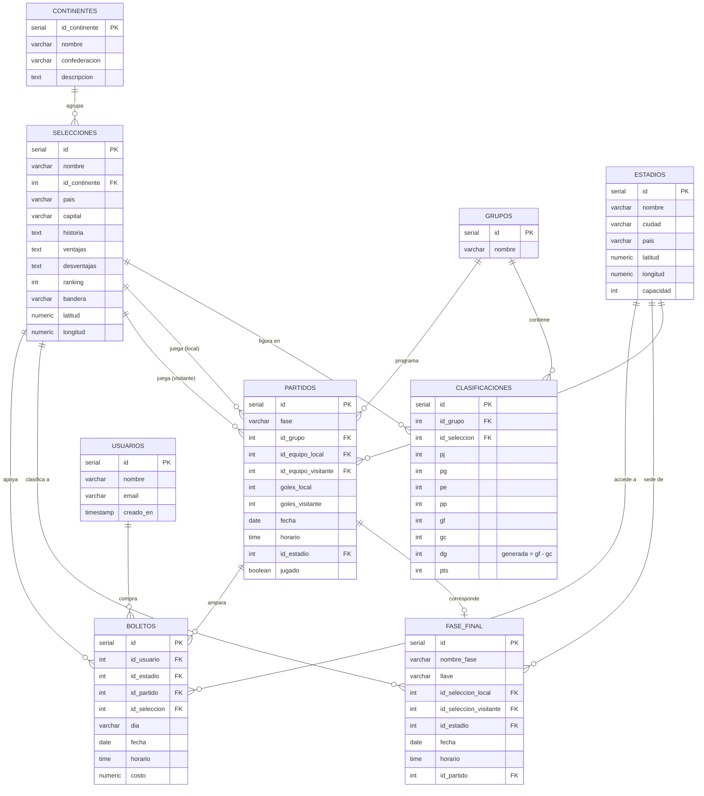

# Diagrama Entidad–Relación — Copa Mundial FIFA 2026

Base de datos: **PostgreSQL** · 9 tablas principales.

> Este diagrama está en formato **Mermaid**. Se visualiza automáticamente en GitHub,
> en VS Code (extensión *Markdown Preview Mermaid*) o en <https://mermaid.live> para
> exportarlo como imagen/PDF.

## Relaciones (cardinalidad)

| Relación | Tipo | Descripción |
|----------|------|-------------|
| Continentes → Selecciones | 1 : N | Cada selección pertenece a un continente/confederación |
| Grupos → Clasificaciones | 1 : N | Un grupo tiene 4 filas de clasificación |
| Selecciones → Clasificaciones | 1 : N | Una selección aparece en la tabla de su grupo |
| Grupos → Partidos | 1 : N | Los partidos de la fase de grupos pertenecen a un grupo |
| Selecciones → Partidos | 1 : N (×2) | Como equipo local y como visitante |
| Estadios → Partidos | 1 : N | Cada partido se juega en un estadio |
| Estadios → Fase_final | 1 : N | Sede asignada automáticamente a cada llave |
| Selecciones → Fase_final | 1 : N (×2) | Clasificados local/visitante de cada llave |
| Usuarios → Boletos | 1 : N | Un usuario compra varios boletos |
| Estadios/Partidos/Selecciones → Boletos | 1 : N | Detalle del boleto |

## Reglas de negocio implementadas en la BD

- **Columna generada** `dg = gf - gc` en `clasificaciones` (siempre consistente).
- **Función** `fn_recalcular_clasificacion(grupo)`: recalcula PJ/PG/PE/PP/GF/GC/Pts
  desde los partidos jugados (victoria=3, empate=1, derrota=0).
- **Trigger** `tg_partido_clasificacion`: ante cualquier alta/cambio/baja de un
  partido de grupos, recalcula automáticamente la tabla de posiciones.
- **Vistas**: `v_clasificacion` (posiciones ordenadas con desempate),
  `v_paises` (país + continente + confederación) y `v_partidos` (partidos con nombres).
