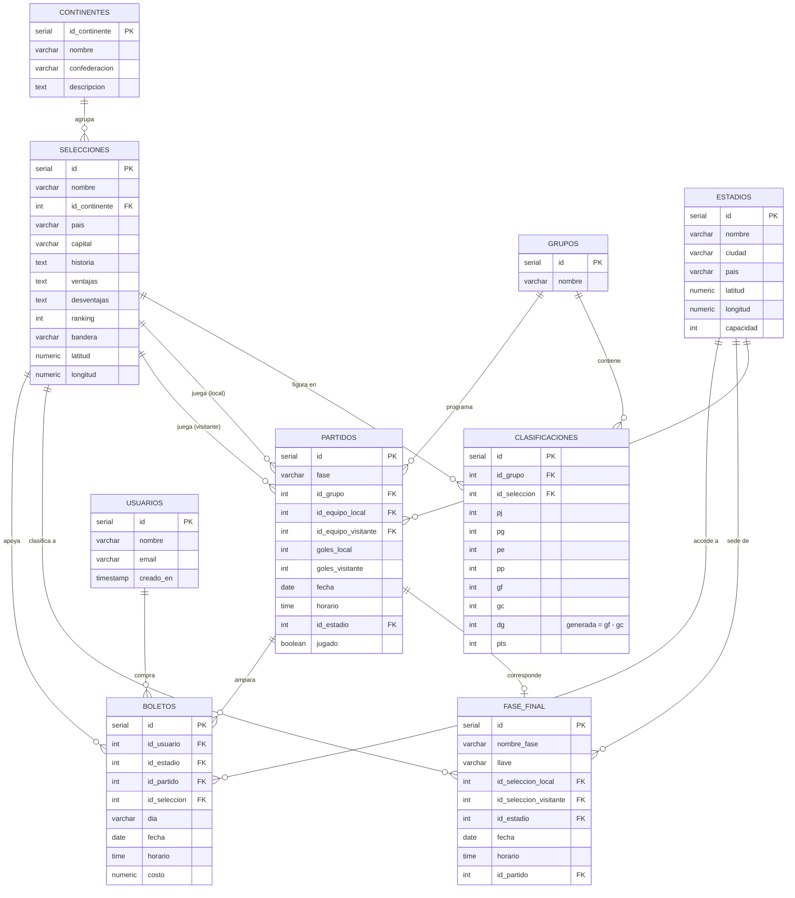

# Copa Mundial FIFA 2026
## Sistema de Simulación, Administración y Geolocalización
### Primera Entrega — Base de Datos

---

| Campo | Dato |
|-------|------|
| **Universidad** | _______________________________ |
| **Materia** | _______________________________ |
| **Maestro(a)** | _______________________________ |
| **Equipo** | _______________________________ |
| **Integrantes** | _______________________________ |
| | _______________________________ |
| | _______________________________ |
| **Base de datos asignada** | **PostgreSQL** |
| **Datos actualizados al** | 26 de junio de 2026 |

---

## Índice

1. Base de datos completa del sistema
2. Diagrama Entidad–Relación
3. Grupos capturados con su información
4. Consultas solicitadas en clase (con resultados)
5. Consultas adicionales (con resultados)

---

## 1. Base de datos completa del sistema

La base de datos fue desarrollada en **PostgreSQL**. Se entregan los siguientes archivos:

- **`db/schema.sql`** — Estructura completa: 9 tablas, restricciones (PK, FK, CHECK, UNIQUE),
  una **columna generada** (`dg = gf - gc`), una **función almacenada**
  (`fn_recalcular_clasificacion`), un **trigger** que recalcula la tabla de posiciones
  automáticamente y tres **vistas** de apoyo.
- **`db/seed.sql`** — Datos **reales del Mundial 2026 al 26/06/2026**: **48 selecciones**
  (con geolocalización), **16 estadios** sede, **12 grupos**, **72 partidos** de la fase de grupos
  (**60 ya jugados** + 12 programados) y **20 boletos**. Los grupos A–F completaron las 3
  jornadas; los grupos G–L llevan 2 jornadas (la 3.ª queda programada).

### Tablas del sistema

| # | Tabla | Descripción |
|---|-------|-------------|
| 1 | `continentes` | Continentes y su confederación FIFA |
| 2 | `selecciones` | Selecciones nacionales con geolocalización (lat/lon de la capital) |
| 3 | `grupos` | 12 grupos (A–L) |
| 4 | `estadios` | Estadios sede en México, EE. UU. y Canadá con geolocalización |
| 5 | `partidos` | Partidos de la fase de grupos y de la fase final |
| 6 | `clasificaciones` | Tabla de posiciones por grupo (PJ, PG, PE, PP, GF, GC, DG, Pts) |
| 7 | `fase_final` | Cuadro de eliminatorias con sedes asignadas automáticamente |
| 8 | `usuarios` | Usuarios del sistema |
| 9 | `boletos` | Boletos comprados por los usuarios |

### Importación de la base de datos

```bash
# Con Docker (recomendado): el contenedor carga schema.sql y seed.sql automáticamente
docker compose up -d

# O de forma manual sobre un PostgreSQL existente:
psql -U usuario -d mundial2026 -f db/schema.sql
psql -U usuario -d mundial2026 -f db/seed.sql
```


### Script SQL completo de creación de la base de datos (`schema.sql`)

A continuación se incluye el **script completo** que genera toda la base de datos en PostgreSQL (las 9 tablas con sus restricciones PK/FK/CHECK/UNIQUE, la columna generada, la función almacenada, el disparador/trigger de clasificación y las vistas). Este mismo script se entrega como archivo `db/schema.sql`, y junto con los datos en `db/instalar.sql`.

```sql
-- ============================================================================
--  COPA MUNDIAL FIFA 2026  -  Esquema de Base de Datos (PostgreSQL)
--  Sistema de Simulacion, Administracion y Geolocalizacion
-- ----------------------------------------------------------------------------
--  Motor: PostgreSQL 16
--  Este script crea TODAS las tablas, restricciones, funciones, disparadores
--  (triggers) y vistas del sistema. Es idempotente: borra y recrea el esquema.
-- ============================================================================

-- Reiniciar esquema (entorno de desarrollo / examen)
DROP SCHEMA IF EXISTS public CASCADE;
CREATE SCHEMA public;
SET client_encoding = 'UTF8';

-- ============================================================================
-- 1) CONTINENTES  (un continente <-> una confederacion FIFA)
--    Europa=UEFA, America del Sur=CONMEBOL, Norteamerica=CONCACAF,
--    Africa=CAF, Asia=AFC, Oceania=OFC
-- ============================================================================
CREATE TABLE continentes (
    id_continente   SERIAL PRIMARY KEY,
    nombre          VARCHAR(60)  NOT NULL UNIQUE,   -- Continente
    confederacion   VARCHAR(20)  NOT NULL UNIQUE,   -- Confederacion FIFA
    descripcion     TEXT
);

COMMENT ON TABLE continentes IS 'Continentes y su confederacion FIFA correspondiente';

-- ============================================================================
-- 2) SELECCIONES  (con geolocalizacion de la capital del pais)
-- ============================================================================
CREATE TABLE selecciones (
    id              SERIAL PRIMARY KEY,
    nombre          VARCHAR(80)  NOT NULL UNIQUE,    -- Nombre de la seleccion
    id_continente   INT          NOT NULL REFERENCES continentes(id_continente),
    pais            VARCHAR(80)  NOT NULL,
    capital         VARCHAR(80),
    historia        TEXT,
    ventajas        TEXT,
    desventajas     TEXT,
    ranking         INT          CHECK (ranking > 0),  -- Ranking FIFA mundial
    bandera         VARCHAR(16),                        -- Emoji de la bandera
    latitud         NUMERIC(9,6),                       -- Geolocalizacion
    longitud        NUMERIC(9,6)
);

COMMENT ON TABLE selecciones IS 'Selecciones nacionales participantes con geolocalizacion';
CREATE INDEX idx_selecciones_continente ON selecciones(id_continente);
CREATE INDEX idx_selecciones_ranking    ON selecciones(ranking);

-- ============================================================================
-- 3) GRUPOS  (12 grupos de 4 equipos: A .. L)
-- ============================================================================
CREATE TABLE grupos (
    id      SERIAL PRIMARY KEY,
    nombre  VARCHAR(5) NOT NULL UNIQUE   -- A, B, C, ...
);

COMMENT ON TABLE grupos IS '12 grupos de la fase de grupos';

-- ============================================================================
-- 4) ESTADIOS  (sedes en Mexico, Estados Unidos y Canada, con geolocalizacion)
-- ============================================================================
CREATE TABLE estadios (
    id          SERIAL PRIMARY KEY,
    nombre      VARCHAR(100) NOT NULL,
    ciudad      VARCHAR(80)  NOT NULL,
    pais        VARCHAR(60)  NOT NULL,
    latitud     NUMERIC(9,6) NOT NULL,
    longitud    NUMERIC(9,6) NOT NULL,
    capacidad   INT          CHECK (capacidad > 0)
);

COMMENT ON TABLE estadios IS 'Estadios sede con geolocalizacion';

-- ============================================================================
-- 5) PARTIDOS  (fase de grupos y fase final)
-- ============================================================================
CREATE TABLE partidos (
    id                  SERIAL PRIMARY KEY,
    fase                VARCHAR(20) NOT NULL DEFAULT 'Grupos'
                        CHECK (fase IN ('Grupos','Dieciseisavos','Octavos',
                                        'Cuartos','Semifinal','Tercer Lugar','Final')),
    id_grupo            INT REFERENCES grupos(id) ON DELETE SET NULL,  -- NULL en fase final
    id_equipo_local     INT NOT NULL REFERENCES selecciones(id),
    id_equipo_visitante INT NOT NULL REFERENCES selecciones(id),
    goles_local         INT CHECK (goles_local >= 0),
    goles_visitante     INT CHECK (goles_visitante >= 0),
    fecha               DATE,
    horario             TIME,
    id_estadio          INT REFERENCES estadios(id),
    jugado              BOOLEAN NOT NULL DEFAULT FALSE,
    CONSTRAINT chk_equipos_distintos CHECK (id_equipo_local <> id_equipo_visitante)
);

COMMENT ON TABLE partidos IS 'Partidos de todas las fases del torneo';
CREATE INDEX idx_partidos_grupo   ON partidos(id_grupo);
CREATE INDEX idx_partidos_estadio ON partidos(id_estadio);
CREATE INDEX idx_partidos_fase    ON partidos(fase);

-- ============================================================================
-- 6) CLASIFICACIONES  (tabla de posiciones por grupo)
--    dg = gf - gc es columna GENERADA (siempre consistente).
-- ============================================================================
CREATE TABLE clasificaciones (
    id              SERIAL PRIMARY KEY,
    id_grupo        INT NOT NULL REFERENCES grupos(id) ON DELETE CASCADE,
    id_seleccion    INT NOT NULL REFERENCES selecciones(id) ON DELETE CASCADE,
    pj              INT NOT NULL DEFAULT 0,   -- Partidos jugados
    pg              INT NOT NULL DEFAULT 0,   -- Ganados
    pe              INT NOT NULL DEFAULT 0,   -- Empatados
    pp              INT NOT NULL DEFAULT 0,   -- Perdidos
    gf              INT NOT NULL DEFAULT 0,   -- Goles a favor
    gc              INT NOT NULL DEFAULT 0,   -- Goles en contra
    dg              INT GENERATED ALWAYS AS (gf - gc) STORED,  -- Diferencia de goles
    pts             INT NOT NULL DEFAULT 0,   -- Puntos
    UNIQUE (id_grupo, id_seleccion)
);

COMMENT ON TABLE clasificaciones IS 'Tabla de posiciones por grupo (se recalcula con triggers)';

-- ============================================================================
-- 7) FASE FINAL  (eliminatorias: sede asignada automaticamente tras los grupos)
-- ============================================================================
CREATE TABLE fase_final (
    id                      SERIAL PRIMARY KEY,
    nombre_fase             VARCHAR(20) NOT NULL
                            CHECK (nombre_fase IN ('Dieciseisavos','Octavos',
                                   'Cuartos','Semifinal','Tercer Lugar','Final')),
    llave                   VARCHAR(20),    -- Identificador de la llave, ej. 'O1'
    id_seleccion_local      INT REFERENCES selecciones(id),  -- Clasificado 1
    id_seleccion_visitante  INT REFERENCES selecciones(id),  -- Clasificado 2
    id_estadio              INT REFERENCES estadios(id),     -- Sede
    fecha                   DATE,
    horario                 TIME,
    id_partido              INT REFERENCES partidos(id) ON DELETE SET NULL
);

COMMENT ON TABLE fase_final IS 'Cuadro de eliminatorias con sedes asignadas';

-- ============================================================================
-- 8) USUARIOS
-- ============================================================================
CREATE TABLE usuarios (
    id          SERIAL PRIMARY KEY,
    nombre      VARCHAR(120) NOT NULL,
    email       VARCHAR(160) UNIQUE,
    creado_en   TIMESTAMP NOT NULL DEFAULT NOW()
);

COMMENT ON TABLE usuarios IS 'Usuarios del sistema (compradores de boletos)';

-- ============================================================================
-- 9) BOLETOS
-- ============================================================================
CREATE TABLE boletos (
    id              SERIAL PRIMARY KEY,
    id_usuario      INT NOT NULL REFERENCES usuarios(id) ON DELETE CASCADE,
    id_estadio      INT NOT NULL REFERENCES estadios(id),
    id_partido      INT REFERENCES partidos(id) ON DELETE SET NULL,
    id_seleccion    INT REFERENCES selecciones(id),
    dia             VARCHAR(20),     -- Dia de la semana / jornada
    fecha           DATE,
    horario         TIME,
    costo           NUMERIC(10,2) CHECK (costo >= 0)
);

COMMENT ON TABLE boletos IS 'Boletos comprados por los usuarios';

-- ============================================================================
--  LOGICA DE CLASIFICACION  (algoritmo de clasificacion en la BD)
--  Recalcula la tabla de posiciones de un grupo a partir de los partidos
--  jugados. Victoria=3 pts, Empate=1 pt, Derrota=0 pts.
-- ============================================================================
CREATE OR REPLACE FUNCTION fn_recalcular_clasificacion(p_grupo INT)
RETURNS VOID AS $$
BEGIN
    -- 1) Reiniciar estadisticas del grupo
    UPDATE clasificaciones
       SET pj = 0, pg = 0, pe = 0, pp = 0, gf = 0, gc = 0, pts = 0
     WHERE id_grupo = p_grupo;

    -- 2) Recalcular desde los partidos jugados (cada partido aporta 2 filas:
    --    la del local y la del visitante)
    WITH eventos AS (
        SELECT id_equipo_local  AS id_seleccion, goles_local AS gf, goles_visitante AS gc
          FROM partidos
         WHERE id_grupo = p_grupo AND jugado = TRUE
        UNION ALL
        SELECT id_equipo_visitante, goles_visitante, goles_local
          FROM partidos
         WHERE id_grupo = p_grupo AND jugado = TRUE
    ),
    agg AS (
        SELECT id_seleccion,
               COUNT(*)                                              AS pj,
               SUM(CASE WHEN gf > gc THEN 1 ELSE 0 END)              AS pg,
               SUM(CASE WHEN gf = gc THEN 1 ELSE 0 END)              AS pe,
               SUM(CASE WHEN gf < gc THEN 1 ELSE 0 END)              AS pp,
               SUM(gf)                                               AS gf,
               SUM(gc)                                               AS gc,
               SUM(CASE WHEN gf > gc THEN 3 WHEN gf = gc THEN 1 ELSE 0 END) AS pts
          FROM eventos
         GROUP BY id_seleccion
    )
    UPDATE clasificaciones c
       SET pj = a.pj, pg = a.pg, pe = a.pe, pp = a.pp,
           gf = a.gf, gc = a.gc, pts = a.pts
      FROM agg a
     WHERE c.id_grupo = p_grupo
       AND c.id_seleccion = a.id_seleccion;
END;
$$ LANGUAGE plpgsql;

-- Disparador: cualquier alta/cambio/baja de un partido de grupos recalcula
-- automaticamente la tabla de posiciones del grupo afectado.
CREATE OR REPLACE FUNCTION trg_partido_clasificacion()
RETURNS TRIGGER AS $$
DECLARE
    v_grupo INT;
BEGIN
    IF TG_OP = 'DELETE' THEN
        v_grupo := OLD.id_grupo;
    ELSE
        v_grupo := NEW.id_grupo;
    END IF;

    IF v_grupo IS NOT NULL THEN
        PERFORM fn_recalcular_clasificacion(v_grupo);
    END IF;

    RETURN NULL;
END;
$$ LANGUAGE plpgsql;

CREATE TRIGGER tg_partido_clasificacion
AFTER INSERT OR UPDATE OR DELETE ON partidos
FOR EACH ROW EXECUTE FUNCTION trg_partido_clasificacion();

-- ============================================================================
--  VISTAS DE APOYO
-- ============================================================================

-- Tabla de posiciones ordenada con posicion (algoritmo de desempate:
-- puntos > diferencia de goles > goles a favor)
CREATE OR REPLACE VIEW v_clasificacion AS
SELECT g.nombre                       AS grupo,
       s.bandera,
       s.nombre                       AS seleccion,
       c.pj, c.pg, c.pe, c.pp, c.gf, c.gc, c.dg, c.pts,
       RANK() OVER (PARTITION BY c.id_grupo
                    ORDER BY c.pts DESC, c.dg DESC, c.gf DESC) AS posicion
  FROM clasificaciones c
  JOIN grupos      g ON g.id = c.id_grupo
  JOIN selecciones s ON s.id = c.id_seleccion;

-- Vista de paises con su continente y confederacion
CREATE OR REPLACE VIEW v_paises AS
SELECT co.id_continente,
       co.nombre        AS continente,
       co.confederacion,
       s.pais,
       s.nombre         AS seleccion,
       s.ranking,
       s.bandera
  FROM selecciones s
  JOIN continentes co ON co.id_continente = s.id_continente;

-- Vista detallada de partidos (nombres en lugar de IDs)
CREATE OR REPLACE VIEW v_partidos AS
SELECT p.id,
       p.fase,
       g.nombre              AS grupo,
       sl.nombre             AS local,
       sl.bandera            AS bandera_local,
       sv.nombre             AS visitante,
       sv.bandera            AS bandera_visitante,
       p.goles_local,
       p.goles_visitante,
       p.fecha,
       p.horario,
       e.nombre              AS estadio,
       e.ciudad,
       e.pais,
       p.jugado
  FROM partidos p
  JOIN selecciones sl ON sl.id = p.id_equipo_local
  JOIN selecciones sv ON sv.id = p.id_equipo_visitante
  LEFT JOIN grupos   g ON g.id = p.id_grupo
  LEFT JOIN estadios e ON e.id = p.id_estadio;

-- ============================================================================
--  FIN DEL ESQUEMA
-- ============================================================================
```

---

## 2. Diagrama Entidad–Relación


Base de datos: **PostgreSQL** · 9 tablas principales.

> Este diagrama está en formato **Mermaid**. Se visualiza automáticamente en GitHub,
> en VS Code (extensión *Markdown Preview Mermaid*) o en <https://mermaid.live> para
> exportarlo como imagen/PDF.



## Relaciones (cardinalidad)

| Relación | Tipo | Descripción |
|----------|------|-------------|
| Continentes → Selecciones | 1 : N | Cada selección pertenece a un continente/confederación |
| Grupos → Clasificaciones | 1 : N | Un grupo tiene 4 filas de clasificación |
| Selecciones → Clasificaciones | 1 : N | Una selección aparece en la tabla de su grupo |
| Grupos → Partidos | 1 : N | Los partidos de la fase de grupos pertenecen a un grupo |
| Selecciones → Partidos | 1 : N (×2) | Como equipo local y como visitante |
| Estadios → Partidos | 1 : N | Cada partido se juega en un estadio |
| Estadios → Fase_final | 1 : N | Sede asignada automáticamente a cada llave |
| Selecciones → Fase_final | 1 : N (×2) | Clasificados local/visitante de cada llave |
| Usuarios → Boletos | 1 : N | Un usuario compra varios boletos |
| Estadios/Partidos/Selecciones → Boletos | 1 : N | Detalle del boleto |

## Reglas de negocio implementadas en la BD

- **Columna generada** `dg = gf - gc` en `clasificaciones` (siempre consistente).
- **Función** `fn_recalcular_clasificacion(grupo)`: recalcula PJ/PG/PE/PP/GF/GC/Pts
  desde los partidos jugados (victoria=3, empate=1, derrota=0).
- **Trigger** `tg_partido_clasificacion`: ante cualquier alta/cambio/baja de un
  partido de grupos, recalcula automáticamente la tabla de posiciones.
- **Vistas**: `v_clasificacion` (posiciones ordenadas con desempate),
  `v_paises` (país + continente + confederación) y `v_partidos` (partidos con nombres).

---

## 3. Grupos capturados con su información

Se capturaron los **12 grupos** reales del Mundial 2026 (el examen pedía al menos 6), con las posiciones oficiales al **26/06/2026**. Los grupos A–F ya disputaron las 3 jornadas; los grupos G–L llevan 2 jornadas jugadas. Para cada selección se incluye su confederación, ranking FIFA, capital, geolocalización (latitud/longitud), historia, ventajas y desventajas. Debajo de cada grupo se muestra su tabla de posiciones calculada por el sistema.

### Grupo A

| Bandera | Selección | País | Confed. | Ranking | Capital | Latitud | Longitud |
| --- | --- | --- | --- | --- | --- | --- | --- |
| 🇲🇽 | Mexico | Mexico | CONCACAF | 14 | Ciudad de Mexico | 19.432600 | -99.133200 |
| 🇰🇷 | Corea del Sur | Corea del Sur | AFC | 23 | Seul | 37.566500 | 126.978000 |
| 🇨🇿 | Republica Checa | Republica Checa | UEFA | 40 | Praga | 50.075500 | 14.437800 |
| 🇿🇦 | Sudafrica | Sudafrica | CAF | 56 | Pretoria | -25.747900 | 28.229300 |

- **🇲🇽 Mexico** — Mexico es la potencia historica de la CONCACAF y uno de los participantes mas constantes de los mundiales. Alcanzo los cuartos de final en 1970 y 1986, ambos como anfitrion, su mejor resultado historico. En 2026 vuelve a ser sede mundialista por tercera vez. _Ventajas:_ Gran experiencia mundialista, aficion extremadamente solida y plantel competitivo con jugadores en ligas europeas. _Desventajas:_ Recurrente incapacidad para superar los octavos de final, la llamada maldicion del quinto partido.
- **🇰🇷 Corea del Sur** — Corea del Sur es el equipo asiatico con mas participaciones mundialistas y alcanzo las semifinales como anfitrion en 2002, su mejor resultado historico. Clasifica a los Mundiales de manera regular desde 1986. Liderada por figuras como Son Heung-min, mantiene un nivel competitivo constante. _Ventajas:_ Intensidad fisica, gran capacidad de presion y el talento individual de Son Heung-min. _Desventajas:_ Defensa vulnerable ante rivales tecnicos y dependencia excesiva de sus estrellas.
- **🇨🇿 Republica Checa** — Heredera de la escuela checoslovaca, fue subcampeona de la Eurocopa 1996 y semifinalista mundialista en 1934 y 1962. Mantiene una solida tradicion en Europa central. _Ventajas:_ Orden tactico y buena tecnica individual. _Desventajas:_ Generacion en transicion sin grandes estrellas.
- **🇿🇦 Sudafrica** — Sudafrica organizo el Mundial de 2010, el primero en suelo africano. Gano la Copa Africana de Naciones en 1996 como anfitriona. Los Bafana Bafana regresan a la elite mundial. _Ventajas:_ Velocidad, juego colectivo dinamico y buen estado fisico. _Desventajas:_ Irregularidad y poca experiencia mundialista reciente.

**Tabla de posiciones — Grupo A:**

| Pos | Bandera | Selección | PJ | PG | PE | PP | GF | GC | DG | Pts |
| --- | --- | --- | --- | --- | --- | --- | --- | --- | --- | --- |
| 1 | 🇲🇽 | Mexico | 3 | 3 | 0 | 0 | 6 | 0 | 6 | 9 |
| 2 | 🇿🇦 | Sudafrica | 3 | 1 | 1 | 1 | 2 | 3 | -1 | 4 |
| 3 | 🇰🇷 | Corea del Sur | 3 | 1 | 0 | 2 | 2 | 3 | -1 | 3 |
| 4 | 🇨🇿 | Republica Checa | 3 | 0 | 1 | 2 | 2 | 6 | -4 | 1 |

---

### Grupo B

| Bandera | Selección | País | Confed. | Ranking | Capital | Latitud | Longitud |
| --- | --- | --- | --- | --- | --- | --- | --- |
| 🇨🇭 | Suiza | Suiza | UEFA | 19 | Berna | 46.948000 | 7.447400 |
| 🇨🇦 | Canada | Canada | CONCACAF | 30 | Ottawa | 45.421500 | -75.697200 |
| 🇶🇦 | Catar | Catar | AFC | 36 | Doha | 25.285400 | 51.531000 |
| 🇧🇦 | Bosnia y Herzegovina | Bosnia y Herzegovina | UEFA | 74 | Sarajevo | 43.856300 | 18.413100 |

- **🇨🇭 Suiza** — Suiza es una participante habitual de los Mundiales, alcanzando octavos en 2014, 2018 y 2022. Llego a cuartos en la Eurocopa 2020 y 2024. Destaca por su solidez y regularidad. _Ventajas:_ Equipo ordenado, disciplinado y dificil de batir. _Desventajas:_ Le falta jerarquia ofensiva para pelear titulos.
- **🇨🇦 Canada** — Canada disputo su primer Mundial en 1986 sin anotar goles y volvio a la cita tras 36 anos en 2022. Ha crecido enormemente impulsado por figuras como Alphonso Davies y Jonathan David. En 2026 sera anfitrion por primera vez en su historia. _Ventajas:_ Velocidad y dinamismo ofensivo con figuras de talla mundial y proyeccion en ascenso. _Desventajas:_ Poca profundidad de plantel y limitada experiencia en fases finales mundialistas.
- **🇶🇦 Catar** — Catar fue anfitrion del Mundial 2022 y es el vigente bicampeon de la Copa Asiatica (2019 y 2023). Aunque su debut mundialista fue discreto, ha invertido fuertemente en su desarrollo futbolistico. Es una de las selecciones emergentes mas fuertes del continente. _Ventajas:_ Generacion talentosa y campeona continental con buen toque y movilidad. _Desventajas:_ Escasa experiencia ganadora a nivel mundial y bajo rendimiento ante selecciones de elite.
- **🇧🇦 Bosnia y Herzegovina** — Debuto en el Mundial de Brasil 2014 con figuras como Edin Dzeko. Es una seleccion competitiva del sureste europeo que vuelve a la cita mundialista. _Ventajas:_ Poder ofensivo y caracter competitivo. _Desventajas:_ Defensa vulnerable y poca profundidad de plantel.

**Tabla de posiciones — Grupo B:**

| Pos | Bandera | Selección | PJ | PG | PE | PP | GF | GC | DG | Pts |
| --- | --- | --- | --- | --- | --- | --- | --- | --- | --- | --- |
| 1 | 🇨🇭 | Suiza | 3 | 2 | 1 | 0 | 7 | 3 | 4 | 7 |
| 2 | 🇨🇦 | Canada | 3 | 1 | 1 | 1 | 8 | 3 | 5 | 4 |
| 3 | 🇧🇦 | Bosnia y Herzegovina | 3 | 1 | 1 | 1 | 5 | 6 | -1 | 4 |
| 4 | 🇶🇦 | Catar | 3 | 0 | 1 | 2 | 2 | 10 | -8 | 1 |

---

### Grupo C

| Bandera | Selección | País | Confed. | Ranking | Capital | Latitud | Longitud |
| --- | --- | --- | --- | --- | --- | --- | --- |
| 🇧🇷 | Brasil | Brasil | CONMEBOL | 6 | Brasilia | -15.793900 | -47.882800 |
| 🇲🇦 | Marruecos | Marruecos | CAF | 7 | Rabat | 34.020900 | -6.841700 |
| 🏴󠁧󠁢󠁳󠁣󠁴󠁿 | Escocia | Escocia | UEFA | 39 | Edimburgo | 55.953300 | -3.188300 |
| 🇭🇹 | Haiti | Haiti | CONCACAF | 86 | Puerto Principe | 18.594400 | -72.307400 |

- **🇧🇷 Brasil** — Brasil es la unica seleccion pentacampeona del mundo (1958, 1962, 1970, 1994 y 2002). Es el equipo con mas participaciones mundialistas y nunca ha faltado a una Copa del Mundo. Representa la maxima tradicion del jogo bonito. _Ventajas:_ Abundante talento ofensivo individual y una cantera inagotable de futbolistas de elite. _Desventajas:_ Inestabilidad reciente y falta de un proyecto solido tras varios cambios de entrenador.
- **🇲🇦 Marruecos** — Marruecos hizo historia en Catar 2022 al convertirse en la primera seleccion africana en alcanzar las semifinales de un Mundial. Debutaron en 1970 y en 1986 fueron el primer pais africano en superar la fase de grupos. Son hoy el referente del futbol del continente. _Ventajas:_ Defensa solida y bloque compacto con jugadores de elite europea como Hakimi y Amrabat. _Desventajas:_ Dependen mucho de su solidez defensiva y a veces les falta contundencia en ataque.
- **🏴󠁧󠁢󠁳󠁣󠁴󠁿 Escocia** — Escocia es pionera del futbol y disputo varios Mundiales entre 1954 y 1998. No supera la fase de grupos en su historia mundialista. Resurgio clasificando a las Eurocopas 2020 y 2024. _Ventajas:_ Espiritu combativo y solido funcionamiento colectivo. _Desventajas:_ Limitado talento individual frente a las grandes potencias.
- **🇭🇹 Haiti** — Haiti disputo su unico Mundial en Alemania 1974. Es una de las selecciones historicas del Caribe que regresa a la maxima cita pese a sus dificultades. _Ventajas:_ Talento individual y velocidad en ataque. _Desventajas:_ Falta de recursos e infraestructura futbolistica.

**Tabla de posiciones — Grupo C:**

| Pos | Bandera | Selección | PJ | PG | PE | PP | GF | GC | DG | Pts |
| --- | --- | --- | --- | --- | --- | --- | --- | --- | --- | --- |
| 1 | 🇧🇷 | Brasil | 3 | 2 | 1 | 0 | 7 | 1 | 6 | 7 |
| 2 | 🇲🇦 | Marruecos | 3 | 2 | 1 | 0 | 6 | 3 | 3 | 7 |
| 3 | 🏴󠁧󠁢󠁳󠁣󠁴󠁿 | Escocia | 3 | 1 | 0 | 2 | 1 | 4 | -3 | 3 |
| 4 | 🇭🇹 | Haiti | 3 | 0 | 0 | 3 | 2 | 8 | -6 | 0 |

---

### Grupo D

| Bandera | Selección | País | Confed. | Ranking | Capital | Latitud | Longitud |
| --- | --- | --- | --- | --- | --- | --- | --- |
| 🇺🇸 | Estados Unidos | Estados Unidos | CONCACAF | 17 | Washington D. C. | 38.907200 | -77.036900 |
| 🇦🇺 | Australia | Australia | AFC | 25 | Canberra | -35.280900 | 149.130000 |
| 🇹🇷 | Turquia | Turquia | UEFA | 26 | Ankara | 39.933400 | 32.859700 |
| 🇵🇾 | Paraguay | Paraguay | CONMEBOL | 41 | Asuncion | -25.263700 | -57.575900 |

- **🇺🇸 Estados Unidos** — Estados Unidos fue semifinalista en el primer Mundial de 1930 y resurgio como potencia regional tras organizar el torneo de 1994. Llego a cuartos de final en 2002, su mejor actuacion moderna. Coorganiza el Mundial 2026 con una generacion joven y talentosa. _Ventajas:_ Generacion joven con muchos jugadores en clubes europeos de primer nivel y condicion de local. _Desventajas:_ Inconsistencia ante rivales fuertes y falta de un goleador de elite consolidado.
- **🇦🇺 Australia** — Australia se integro a la AFC en 2006 y desde entonces es habitual en los Mundiales. En 2022 alcanzo los octavos de final tras una destacada fase de grupos. Los Socceroos combinan fisico europeo con experiencia internacional. _Ventajas:_ Fortaleza fisica, gran mentalidad competitiva y juego aereo dominante. _Desventajas:_ Plantilla con poca profundidad de talento de primer nivel y limitaciones tecnicas.
- **🇹🇷 Turquia** — Turquia logro un historico tercer puesto en el Mundial 2002. Llego a cuartos en la Eurocopa 2024 con una generacion prometedora. Es un equipo con creciente proyeccion. _Ventajas:_ Juventud talentosa y gran ambiente de aficion. _Desventajas:_ Inconsistencia y falta de regularidad en torneos largos.
- **🇵🇾 Paraguay** — Paraguay alcanzo los cuartos de final en Sudafrica 2010, su mejor actuacion mundialista. Es una seleccion historicamente dura y combativa en eliminatorias sudamericanas. Regresa a un Mundial tras varias ausencias. _Ventajas:_ Solidez defensiva y caracter competitivo con orden tactico bajo su cuerpo tecnico. _Desventajas:_ Escasa generacion de juego ofensivo y dependencia de resultados ajustados.

**Tabla de posiciones — Grupo D:**

| Pos | Bandera | Selección | PJ | PG | PE | PP | GF | GC | DG | Pts |
| --- | --- | --- | --- | --- | --- | --- | --- | --- | --- | --- |
| 1 | 🇺🇸 | Estados Unidos | 3 | 2 | 0 | 1 | 8 | 4 | 4 | 6 |
| 2 | 🇦🇺 | Australia | 3 | 1 | 1 | 1 | 2 | 2 | 0 | 4 |
| 3 | 🇵🇾 | Paraguay | 3 | 1 | 1 | 1 | 2 | 4 | -2 | 4 |
| 4 | 🇹🇷 | Turquia | 3 | 1 | 0 | 2 | 3 | 5 | -2 | 3 |

---

### Grupo E

| Bandera | Selección | País | Confed. | Ranking | Capital | Latitud | Longitud |
| --- | --- | --- | --- | --- | --- | --- | --- |
| 🇩🇪 | Alemania | Alemania | UEFA | 9 | Berlin | 52.520000 | 13.405000 |
| 🇪🇨 | Ecuador | Ecuador | CONMEBOL | 23 | Quito | -0.180700 | -78.467800 |
| 🇨🇮 | Costa de Marfil | Costa de Marfil | CAF | 33 | Yamusukro | 6.827600 | -5.289300 |
| 🇨🇼 | Curazao | Curazao | CONCACAF | 82 | Willemstad | 12.108400 | -68.933500 |

- **🇩🇪 Alemania** — Alemania es tetracampeona del mundo (1954, 1974, 1990 y 2014). Es una de las selecciones mas exitosas de la historia. Tras fracasos en 2018 y 2022 busca recuperar su jerarquia. _Ventajas:_ Mentalidad competitiva y estructura tactica solida. _Desventajas:_ Reconstruccion en marcha tras dos Mundiales decepcionantes.
- **🇪🇨 Ecuador** — Ecuador ha clasificado a varios mundiales desde 2002, alcanzando los octavos de final en Alemania 2006. En las eliminatorias recientes mostro solidez pese a deducciones de puntos. Su altura en Quito es un factor diferencial como local. _Ventajas:_ Defensa joven y robusta con gran fortaleza fisica y equipo bien estructurado. _Desventajas:_ Falta de pegada ofensiva y poca experiencia en instancias decisivas mundialistas.
- **🇨🇮 Costa de Marfil** — Costa de Marfil vivio su epoca dorada con la generacion de Drogba, clasificando a tres Mundiales consecutivos. Conquistaron la Copa Africana de Naciones en 1992, 2015 y como anfitriones en 2024. Mantienen una camada talentosa de jugadores en Europa. _Ventajas:_ Plantel equilibrado y campeon continental vigente con confianza renovada. _Desventajas:_ Historial de bajo rendimiento en fases de grupos mundialistas.
- **🇨🇼 Curazao** — Pequena isla del Caribe, Curazao gano la Copa del Caribe 2017 y vive una clasificacion historica aprovechando jugadores de origen neerlandes. _Ventajas:_ Jugadores formados en ligas europeas. _Desventajas:_ Escasa poblacion y nula experiencia mundialista.

**Tabla de posiciones — Grupo E:**

| Pos | Bandera | Selección | PJ | PG | PE | PP | GF | GC | DG | Pts |
| --- | --- | --- | --- | --- | --- | --- | --- | --- | --- | --- |
| 1 | 🇩🇪 | Alemania | 3 | 2 | 0 | 1 | 10 | 4 | 6 | 6 |
| 2 | 🇨🇮 | Costa de Marfil | 3 | 2 | 0 | 1 | 4 | 2 | 2 | 6 |
| 3 | 🇪🇨 | Ecuador | 3 | 1 | 1 | 1 | 2 | 2 | 0 | 4 |
| 4 | 🇨🇼 | Curazao | 3 | 0 | 1 | 2 | 1 | 9 | -8 | 1 |

---

### Grupo F

| Bandera | Selección | País | Confed. | Ranking | Capital | Latitud | Longitud |
| --- | --- | --- | --- | --- | --- | --- | --- |
| 🇳🇱 | Paises Bajos | Paises Bajos | UEFA | 7 | Amsterdam | 52.367600 | 4.904100 |
| 🇯🇵 | Japon | Japon | AFC | 17 | Tokio | 35.676200 | 139.650300 |
| 🇸🇪 | Suecia | Suecia | UEFA | 27 | Estocolmo | 59.329300 | 18.068600 |
| 🇹🇳 | Tunez | Tunez | CAF | 50 | Tunez | 36.806500 | 10.181500 |

- **🇳🇱 Paises Bajos** — Paises Bajos fue subcampeona del mundo en 1974, 1978 y 2010. Es famosa por el 'futbol total'. Pese a su gran historia, nunca ha levantado la Copa del Mundo. _Ventajas:_ Estilo ofensivo y solida defensa con jugadores de top. _Desventajas:_ Inconsistencia y falta de un cierre de torneos ganador.
- **🇯🇵 Japon** — Japon disputa Mundiales de forma ininterrumpida desde 1998 y ha alcanzado los octavos de final en cuatro ediciones. En Catar 2022 sorprendio al vencer a Alemania y Espana en la fase de grupos. Es considerada la potencia futbolistica mas consistente de Asia. _Ventajas:_ Juego colectivo muy organizado, ritmo alto y un bloque de jugadores formados en las mejores ligas europeas. _Desventajas:_ Falta de un goleador de elite y dificultad historica para superar la barrera de los octavos de final.
- **🇸🇪 Suecia** — Suecia fue subcampeona del mundo en 1958 como anfitriona y tercera en 1950 y 1994. Es una potencia tradicional del futbol nordico que llego a cuartos en 2018. _Ventajas:_ Fortaleza fisica y solidez defensiva. _Desventajas:_ Dependencia de transiciones y poca posesion.
- **🇹🇳 Tunez** — Tunez fue el primer pais africano en ganar un partido en un Mundial, en 1978 ante Mexico. Conquistaron la Copa Africana de Naciones en 2004 como anfitriones. En Catar 2022 vencieron a la campeona Francia en fase de grupos. _Ventajas:_ Orden tactico y disciplina defensiva muy consolidada. _Desventajas:_ Escasa capacidad goleadora que les impide superar la fase de grupos.

**Tabla de posiciones — Grupo F:**

| Pos | Bandera | Selección | PJ | PG | PE | PP | GF | GC | DG | Pts |
| --- | --- | --- | --- | --- | --- | --- | --- | --- | --- | --- |
| 1 | 🇳🇱 | Paises Bajos | 3 | 2 | 1 | 0 | 10 | 4 | 6 | 7 |
| 2 | 🇯🇵 | Japon | 3 | 1 | 2 | 0 | 7 | 3 | 4 | 5 |
| 3 | 🇸🇪 | Suecia | 3 | 1 | 1 | 1 | 7 | 7 | 0 | 4 |
| 4 | 🇹🇳 | Tunez | 3 | 0 | 0 | 3 | 2 | 12 | -10 | 0 |

---

### Grupo G

| Bandera | Selección | País | Confed. | Ranking | Capital | Latitud | Longitud |
| --- | --- | --- | --- | --- | --- | --- | --- |
| 🇧🇪 | Belgica | Belgica | UEFA | 8 | Bruselas | 50.850300 | 4.351700 |
| 🇮🇷 | Iran | Iran | AFC | 20 | Teheran | 35.689200 | 51.389000 |
| 🇪🇬 | Egipto | Egipto | CAF | 29 | El Cairo | 30.044400 | 31.235700 |
| 🇳🇿 | Nueva Zelanda | Nueva Zelanda | OFC | 86 | Wellington | -41.286500 | 174.776200 |

- **🇧🇪 Belgica** — Belgica vivio su mejor epoca con la 'generacion dorada', logrando el tercer puesto en el Mundial 2018. Nunca ha conquistado un titulo mayor. Atraviesa una transicion generacional. _Ventajas:_ Jugadores tecnicos con experiencia en grandes ligas. _Desventajas:_ El recambio aun no iguala a la generacion anterior.
- **🇮🇷 Iran** — Iran es una de las selecciones mas dominantes de Asia y suele clasificar con holgura a las eliminatorias finales. Ha participado en multiples Mundiales aunque nunca ha superado la fase de grupos. Cuenta con jugadores destacados en ligas europeas. _Ventajas:_ Solidez defensiva y orden tactico que la convierten en un rival muy dificil de batir. _Desventajas:_ Limitada creatividad ofensiva y poca pegada en momentos decisivos.
- **🇪🇬 Egipto** — Egipto es la seleccion mas laureada de la Copa Africana de Naciones con siete titulos. Disputaron su primer Mundial en 1934, siendo pioneros africanos en el torneo. Han dependido en gran medida del talento de Mohamed Salah en la ultima decada. _Ventajas:_ Cuentan con Mohamed Salah, uno de los mejores delanteros del mundo. _Desventajas:_ Excesiva dependencia de Salah y poca regularidad para clasificar a Mundiales.
- **🇳🇿 Nueva Zelanda** — Nueva Zelanda, apodada los 'All Whites', es la potencia dominante de la OFC y ha clasificado a los Mundiales de 1982 y 2010. En Sudafrica 2010 logro la hazana de terminar invicta en fase de grupos con tres empates, aunque sin avanzar. Para 2026 son los grandes favoritos de Oceania, que por primera vez tiene un cupo directo garantizado. _Ventajas:_ Dominio absoluto de su confederacion con jugadores fisicos y experiencia europea como Chris Wood. _Desventajas:_ Escaso roce competitivo internacional por la debilidad general de los rivales de la OFC.

**Tabla de posiciones — Grupo G:**

| Pos | Bandera | Selección | PJ | PG | PE | PP | GF | GC | DG | Pts |
| --- | --- | --- | --- | --- | --- | --- | --- | --- | --- | --- |
| 1 | 🇪🇬 | Egipto | 2 | 1 | 1 | 0 | 4 | 2 | 2 | 4 |
| 2 | 🇮🇷 | Iran | 2 | 0 | 2 | 0 | 2 | 2 | 0 | 2 |
| 3 | 🇧🇪 | Belgica | 2 | 0 | 2 | 0 | 1 | 1 | 0 | 2 |
| 4 | 🇳🇿 | Nueva Zelanda | 2 | 0 | 1 | 1 | 3 | 5 | -2 | 1 |

---

### Grupo H

| Bandera | Selección | País | Confed. | Ranking | Capital | Latitud | Longitud |
| --- | --- | --- | --- | --- | --- | --- | --- |
| 🇪🇸 | Espana | Espana | UEFA | 3 | Madrid | 40.416800 | -3.703800 |
| 🇺🇾 | Uruguay | Uruguay | CONMEBOL | 16 | Montevideo | -34.901100 | -56.164500 |
| 🇸🇦 | Arabia Saudita | Arabia Saudita | AFC | 58 | Riad | 24.713600 | 46.675300 |
| 🇨🇻 | Cabo Verde | Cabo Verde | CAF | 70 | Praia | 14.921500 | -23.508700 |

- **🇪🇸 Espana** — Espana fue campeona del mundo en 2010 en Sudafrica, su unico titulo mundialista. Domino el futbol entre 2008 y 2012 con dos Eurocopas. Reciente campeona de la Eurocopa 2024. _Ventajas:_ Posesion dominante y un mediocampo creativo de elite. _Desventajas:_ A veces le falta contundencia y un goleador nato.
- **🇺🇾 Uruguay** — Uruguay fue el primer campeon del mundo en 1930 y volvio a conquistar el titulo en 1950 con el historico Maracanazo. Es una potencia tradicional con cuatro estrellas oficiales reconocidas por FIFA. Su garra charrua es legendaria. _Ventajas:_ Renovacion generacional prometedora bajo un esquema tactico ordenado y competitivo. _Desventajas:_ Plantel corto en profundidad y presion por mantener el legado de jugadores historicos.
- **🇸🇦 Arabia Saudita** — Arabia Saudita es una potencia tradicional del futbol asiatico con varias participaciones mundialistas. En Catar 2022 protagonizo una de las mayores sorpresas al vencer a la Argentina campeona. Su liga local ha crecido enormemente atrayendo a estrellas mundiales. _Ventajas:_ Equipo veloz y atrevido, capaz de dar grandes golpes ante favoritos. _Desventajas:_ Inconsistencia y fragilidad defensiva que suele costarle goleadas.
- **🇨🇻 Cabo Verde** — Los Tiburones Azules son una de las grandes sorpresas del futbol africano, con un crecimiento notable en el ranking FIFA y una clasificacion historica. _Ventajas:_ Cohesion grupal y crecimiento sostenido. _Desventajas:_ Plantel limitado por el tamano del pais.

**Tabla de posiciones — Grupo H:**

| Pos | Bandera | Selección | PJ | PG | PE | PP | GF | GC | DG | Pts |
| --- | --- | --- | --- | --- | --- | --- | --- | --- | --- | --- |
| 1 | 🇪🇸 | Espana | 2 | 1 | 1 | 0 | 4 | 0 | 4 | 4 |
| 2 | 🇺🇾 | Uruguay | 2 | 0 | 2 | 0 | 3 | 3 | 0 | 2 |
| 3 | 🇨🇻 | Cabo Verde | 2 | 0 | 2 | 0 | 2 | 2 | 0 | 2 |
| 4 | 🇸🇦 | Arabia Saudita | 2 | 0 | 1 | 1 | 1 | 5 | -4 | 1 |

---

### Grupo I

| Bandera | Selección | País | Confed. | Ranking | Capital | Latitud | Longitud |
| --- | --- | --- | --- | --- | --- | --- | --- |
| 🇫🇷 | Francia | Francia | UEFA | 2 | Paris | 48.856600 | 2.352200 |
| 🇸🇳 | Senegal | Senegal | CAF | 15 | Dakar | 14.692800 | -17.446700 |
| 🇳🇴 | Noruega | Noruega | UEFA | 33 | Oslo | 59.913900 | 10.752200 |
| 🇮🇶 | Iraq | Iraq | AFC | 56 | Bagdad | 33.315200 | 44.366100 |

- **🇫🇷 Francia** — Francia conquisto la Copa del Mundo en 1998 como anfitriona y en 2018 en Rusia. Finalista en 2022 cayendo ante Argentina en penales. Es una de las potencias dominantes del futbol moderno. _Ventajas:_ Plantilla profunda con talento de clase mundial en todas las lineas. _Desventajas:_ Tensiones internas y exceso de confianza pueden afectar al grupo.
- **🇸🇳 Senegal** — Senegal sorprendio al mundo en su debut en 2002 llegando a cuartos de final tras vencer a Francia. Conquistaron la Copa Africana de Naciones en 2021, su primer titulo continental. Se han consolidado como una de las potencias estables de Africa. _Ventajas:_ Plantel fisicamente potente y profundo con figuras como Sadio Mane y Koulibaly. _Desventajas:_ Irregularidad en momentos clave y exceso de confianza ante rivales menores.
- **🇳🇴 Noruega** — Noruega participo en los Mundiales de 1994 y 1998, alcanzando octavos. Tras anos de ausencia, resurge con una generacion liderada por estrellas mundiales. Busca volver a una cita mundialista. _Ventajas:_ Poder ofensivo con figuras de talla mundial. _Desventajas:_ Poca experiencia reciente en fases finales de Mundial.
- **🇮🇶 Iraq** — Iraq fue campeon de la Copa Asiatica en 2007 en una gesta emotiva tras anos de conflicto. Pese a las dificultades para jugar de local, mantiene una base solida de talento. Pelea por regresar a un Mundial tras su unica participacion en 1986. _Ventajas:_ Caracter combativo y jugadores tecnicos con creciente proyeccion internacional. _Desventajas:_ Inestabilidad institucional y falta de continuidad en sus procesos deportivos.

**Tabla de posiciones — Grupo I:**

| Pos | Bandera | Selección | PJ | PG | PE | PP | GF | GC | DG | Pts |
| --- | --- | --- | --- | --- | --- | --- | --- | --- | --- | --- |
| 1 | 🇫🇷 | Francia | 2 | 2 | 0 | 0 | 6 | 1 | 5 | 6 |
| 2 | 🇳🇴 | Noruega | 2 | 2 | 0 | 0 | 7 | 3 | 4 | 6 |
| 3 | 🇸🇳 | Senegal | 2 | 0 | 0 | 2 | 3 | 6 | -3 | 0 |
| 4 | 🇮🇶 | Iraq | 2 | 0 | 0 | 2 | 1 | 7 | -6 | 0 |

---

### Grupo J

| Bandera | Selección | País | Confed. | Ranking | Capital | Latitud | Longitud |
| --- | --- | --- | --- | --- | --- | --- | --- |
| 🇦🇷 | Argentina | Argentina | CONMEBOL | 1 | Buenos Aires | -34.603700 | -58.381600 |
| 🇦🇹 | Austria | Austria | UEFA | 22 | Viena | 48.208200 | 16.373800 |
| 🇩🇿 | Argelia | Argelia | CAF | 28 | Argel | 36.753800 | 3.058800 |
| 🇯🇴 | Jordania | Jordania | AFC | 62 | Aman | 31.953900 | 35.910600 |

- **🇦🇷 Argentina** — Argentina es tricampeona del mundo, con titulos en 1978, 1986 y 2022. La conquista en Qatar 2022 de la mano de Lionel Messi consolido una generacion dorada. Es una de las potencias historicas del futbol mundial. _Ventajas:_ Cuenta con Lionel Messi y una columna vertebral campeona del mundo con gran jerarquia. _Desventajas:_ Dependencia de jugadores veteranos cuya edad avanzada genera dudas sobre su rendimiento.
- **🇦🇹 Austria** — Austria tuvo su epoca dorada en los anos 30 con el 'Wunderteam', logrando el cuarto puesto en 1934. En la era moderna ha vuelto a ser competitiva. Hizo buen papel en la Euro 2024. _Ventajas:_ Intensidad y presion alta bajo esquemas modernos. _Desventajas:_ Falta de experiencia en grandes citas mundialistas recientes.
- **🇩🇿 Argelia** — Argelia protagonizo el famoso partido ante Alemania Occidental en 1982 y alcanzo los octavos de final en Brasil 2014. Fueron campeones de Africa en 1990 y 2019. Cuentan con una generacion talentosa formada en ligas europeas. _Ventajas:_ Medio campo creativo y jugadores tecnicos con experiencia europea. _Desventajas:_ Fragilidad mental y baja productividad tras su titulo continental de 2019.
- **🇯🇴 Jordania** — Jordania alcanzo la final de la Copa Asiatica 2023, su mejor resultado historico, y debuta en una Copa del Mundo con gran ambicion. _Ventajas:_ Orden defensivo y juego directo. _Desventajas:_ Poca experiencia ante potencias mundiales.

**Tabla de posiciones — Grupo J:**

| Pos | Bandera | Selección | PJ | PG | PE | PP | GF | GC | DG | Pts |
| --- | --- | --- | --- | --- | --- | --- | --- | --- | --- | --- |
| 1 | 🇦🇷 | Argentina | 2 | 2 | 0 | 0 | 5 | 0 | 5 | 6 |
| 2 | 🇦🇹 | Austria | 2 | 1 | 0 | 1 | 3 | 3 | 0 | 3 |
| 3 | 🇩🇿 | Argelia | 2 | 1 | 0 | 1 | 2 | 4 | -2 | 3 |
| 4 | 🇯🇴 | Jordania | 2 | 0 | 0 | 2 | 2 | 5 | -3 | 0 |

---

### Grupo K

| Bandera | Selección | País | Confed. | Ranking | Capital | Latitud | Longitud |
| --- | --- | --- | --- | --- | --- | --- | --- |
| 🇵🇹 | Portugal | Portugal | UEFA | 6 | Lisboa | 38.722300 | -9.139300 |
| 🇨🇴 | Colombia | Colombia | CONMEBOL | 13 | Bogota | 4.711000 | -74.072100 |
| 🇨🇩 | Republica Democratica del Congo | Republica Democratica del Congo | CAF | 57 | Kinshasa | -4.441900 | 15.266300 |
| 🇺🇿 | Uzbekistan | Uzbekistan | AFC | 57 | Tashkent | 41.299500 | 69.240100 |

- **🇵🇹 Portugal** — Portugal gano la Eurocopa 2016 y la Liga de Naciones 2019 y 2025. Nunca ha sido campeona del mundo pese a generaciones doradas. Llego a semifinales del Mundial en 1966 y 2006. _Ventajas:_ Talento ofensivo abundante y experiencia ganadora. _Desventajas:_ Dependencia historica de figuras veteranas.
- **🇨🇴 Colombia** — Colombia vivio su epoca dorada en los anos noventa y alcanzo los cuartos de final en Brasil 2014. Fue subcampeona de la Copa America 2024 mostrando un gran nivel. Cuenta con una generacion talentosa liderada por James Rodriguez. _Ventajas:_ Mediocampo creativo y juego asociativo de gran calidad con James Rodriguez en su mejor forma. _Desventajas:_ Irregularidad defensiva y falta de un goleador consistente de area.
- **🇨🇩 Republica Democratica del Congo** — La RD Congo (como Zaire) gano dos Copas Africanas (1968 y 1974) y disputo el Mundial de 1974. Es una cantera de gran talento fisico que resurge en Africa. _Ventajas:_ Potencia fisica y talento individual. _Desventajas:_ Inestabilidad institucional y federativa.
- **🇺🇿 Uzbekistan** — Uzbekistan logro su clasificacion historica al primer Mundial de su historia rumbo a 2026, un hito para el pais. Durante anos estuvo cerca de clasificar pero quedaba eliminado en repechajes. Su generacion actual es la mas talentosa que ha producido. _Ventajas:_ Juventud, hambre competitiva y un bloque cohesionado que crecio juntos. _Desventajas:_ Falta total de experiencia mundialista y poca jerarquia ante grandes rivales.

**Tabla de posiciones — Grupo K:**

| Pos | Bandera | Selección | PJ | PG | PE | PP | GF | GC | DG | Pts |
| --- | --- | --- | --- | --- | --- | --- | --- | --- | --- | --- |
| 1 | 🇨🇴 | Colombia | 2 | 2 | 0 | 0 | 4 | 1 | 3 | 6 |
| 2 | 🇵🇹 | Portugal | 2 | 1 | 1 | 0 | 6 | 1 | 5 | 4 |
| 3 | 🇨🇩 | Republica Democratica del Congo | 2 | 0 | 1 | 1 | 1 | 2 | -1 | 1 |
| 4 | 🇺🇿 | Uzbekistan | 2 | 0 | 0 | 2 | 1 | 8 | -7 | 0 |

---

### Grupo L

| Bandera | Selección | País | Confed. | Ranking | Capital | Latitud | Longitud |
| --- | --- | --- | --- | --- | --- | --- | --- |
| 🏴󠁧󠁢󠁥󠁮󠁧󠁿 | Inglaterra | Inglaterra | UEFA | 4 | Londres | 51.507400 | -0.127800 |
| 🇭🇷 | Croacia | Croacia | UEFA | 11 | Zagreb | 45.815000 | 15.981900 |
| 🇵🇦 | Panama | Panama | CONCACAF | 34 | Ciudad de Panama | 8.982400 | -79.519900 |
| 🇬🇭 | Ghana | Ghana | CAF | 73 | Accra | 5.603700 | -0.187000 |

- **🏴󠁧󠁢󠁥󠁮󠁧󠁿 Inglaterra** — Inglaterra gano su unico Mundial en 1966 como local. Ha sido constante en fases finales recientes, con semifinal en 2018 y cuartos en 2022. Sufre una larga sequia de titulos. _Ventajas:_ Generacion joven y talentosa con gran ataque. _Desventajas:_ Historico bloqueo mental en instancias decisivas.
- **🇭🇷 Croacia** — Croacia fue subcampeona del mundo en 2018 y tercera en 2022. Para un pais pequeno, sus resultados son extraordinarios. Su mediocampo ha sido referencia mundial. _Ventajas:_ Mediocampo de elite y enorme caracter competitivo. _Desventajas:_ Plantilla envejecida en sus figuras clave.
- **🇵🇦 Panama** — Panama vivio un hito historico al clasificar por primera vez a un Mundial en Rusia 2018. Aunque cayo en la fase de grupos, anoto sus primeros goles mundialistas. Desde entonces se ha consolidado como un rival exigente en la CONCACAF. _Ventajas:_ Intensidad fisica, garra competitiva y un bloque defensivo aguerrido. _Desventajas:_ Falta de jerarquia ofensiva ante selecciones de mayor nivel.
- **🇬🇭 Ghana** — Las Estrellas Negras llegaron a cuartos en Sudafrica 2010, rozando la semifinal, y han ganado cuatro Copas Africanas. Son una seleccion muy respetada del continente. _Ventajas:_ Fisico, juventud y tradicion mundialista. _Desventajas:_ Inconsistencia y conflictos internos recurrentes.

**Tabla de posiciones — Grupo L:**

| Pos | Bandera | Selección | PJ | PG | PE | PP | GF | GC | DG | Pts |
| --- | --- | --- | --- | --- | --- | --- | --- | --- | --- | --- |
| 1 | 🏴󠁧󠁢󠁥󠁮󠁧󠁿 | Inglaterra | 2 | 1 | 1 | 0 | 4 | 2 | 2 | 4 |
| 2 | 🇬🇭 | Ghana | 2 | 1 | 1 | 0 | 1 | 0 | 1 | 4 |
| 3 | 🇭🇷 | Croacia | 2 | 1 | 0 | 1 | 3 | 4 | -1 | 3 |
| 4 | 🇵🇦 | Panama | 2 | 0 | 0 | 2 | 0 | 2 | -2 | 0 |

---

## 4. Las 8 consultas solicitadas en clase (con resultados)

## Consulta 1: id_continente, Continente, Confederación y País

```sql
SELECT co.id_continente, co.nombre AS continente, co.confederacion, s.pais
  FROM continentes co
  JOIN selecciones s ON s.id_continente = co.id_continente
 ORDER BY co.id_continente, s.pais;
```

**Resultado (48 filas):**

| id_continente | continente | confederacion | pais |
| --- | --- | --- | --- |
| 1 | Europa | UEFA | Alemania |
| 1 | Europa | UEFA | Austria |
| 1 | Europa | UEFA | Belgica |
| 1 | Europa | UEFA | Bosnia y Herzegovina |
| 1 | Europa | UEFA | Croacia |
| 1 | Europa | UEFA | Escocia |
| 1 | Europa | UEFA | Espana |
| 1 | Europa | UEFA | Francia |
| 1 | Europa | UEFA | Inglaterra |
| 1 | Europa | UEFA | Noruega |
| 1 | Europa | UEFA | Paises Bajos |
| 1 | Europa | UEFA | Portugal |
| 1 | Europa | UEFA | Republica Checa |
| 1 | Europa | UEFA | Suecia |
| 1 | Europa | UEFA | Suiza |
| 1 | Europa | UEFA | Turquia |
| 2 | America del Sur | CONMEBOL | Argentina |
| 2 | America del Sur | CONMEBOL | Brasil |
| 2 | America del Sur | CONMEBOL | Colombia |
| 2 | America del Sur | CONMEBOL | Ecuador |
| 2 | America del Sur | CONMEBOL | Paraguay |
| 2 | America del Sur | CONMEBOL | Uruguay |
| 3 | America del Norte | CONCACAF | Canada |
| 3 | America del Norte | CONCACAF | Curazao |
| 3 | America del Norte | CONCACAF | Estados Unidos |
| 3 | America del Norte | CONCACAF | Haiti |
| 3 | America del Norte | CONCACAF | Mexico |
| 3 | America del Norte | CONCACAF | Panama |
| 4 | Africa | CAF | Argelia |
| 4 | Africa | CAF | Cabo Verde |
| 4 | Africa | CAF | Costa de Marfil |
| 4 | Africa | CAF | Egipto |
| 4 | Africa | CAF | Ghana |
| 4 | Africa | CAF | Marruecos |
| 4 | Africa | CAF | Republica Democratica del Congo |
| 4 | Africa | CAF | Senegal |
| 4 | Africa | CAF | Sudafrica |
| 4 | Africa | CAF | Tunez |
| 5 | Asia | AFC | Arabia Saudita |
| 5 | Asia | AFC | Australia |
| 5 | Asia | AFC | Catar |
| 5 | Asia | AFC | Corea del Sur |
| 5 | Asia | AFC | Iran |
| 5 | Asia | AFC | Iraq |
| 5 | Asia | AFC | Japon |
| 5 | Asia | AFC | Jordania |
| 5 | Asia | AFC | Uzbekistan |
| 6 | Oceania | OFC | Nueva Zelanda |

## Consulta 2: Búsqueda (WHERE) por las diferentes confederaciones, una de cada

```sql
SELECT DISTINCT ON (co.confederacion)
       co.id_continente, co.nombre AS continente, co.confederacion, s.pais, s.nombre AS seleccion
  FROM continentes co
  JOIN selecciones s ON s.id_continente = co.id_continente
 WHERE co.confederacion IN ('UEFA','CONMEBOL','CONCACAF','CAF','AFC','OFC')
 ORDER BY co.confederacion, s.ranking;
```

**Resultado (6 filas):**

| id_continente | continente | confederacion | pais | seleccion |
| --- | --- | --- | --- | --- |
| 5 | Asia | AFC | Japon | Japon |
| 4 | Africa | CAF | Marruecos | Marruecos |
| 3 | America del Norte | CONCACAF | Mexico | Mexico |
| 2 | America del Sur | CONMEBOL | Argentina | Argentina |
| 6 | Oceania | OFC | Nueva Zelanda | Nueva Zelanda |
| 1 | Europa | UEFA | Francia | Francia |

## Consulta 3: id_Selección, Selección, Continente, Confederación, historia, Ventajas, Desventajas, Ranking

```sql
SELECT s.id AS id_seleccion, s.nombre AS seleccion, co.nombre AS continente,
       co.confederacion, s.historia, s.ventajas, s.desventajas, s.ranking
  FROM selecciones s
  JOIN continentes co ON co.id_continente = s.id_continente
 ORDER BY s.ranking;
```

**Resultado (48 filas):**

| id_seleccion | seleccion | continente | confederacion | historia | ventajas | desventajas | ranking |
| --- | --- | --- | --- | --- | --- | --- | --- |
| 37 | Argentina | America del Sur | CONMEBOL | Argentina es tricampeona del mundo, con titulos en 1978, 1986 y 2022. La conquista en Qa… | Cuenta con Lionel Messi y una columna vertebral campeona del mundo con gran jerarquia. | Dependencia de jugadores veteranos cuya edad avanzada genera dudas sobre su rendimiento. | 1 |
| 33 | Francia | Europa | UEFA | Francia conquisto la Copa del Mundo en 1998 como anfitriona y en 2018 en Rusia. Finalist… | Plantilla profunda con talento de clase mundial en todas las lineas. | Tensiones internas y exceso de confianza pueden afectar al grupo. | 2 |
| 29 | Espana | Europa | UEFA | Espana fue campeona del mundo en 2010 en Sudafrica, su unico titulo mundialista. Domino … | Posesion dominante y un mediocampo creativo de elite. | A veces le falta contundencia y un goleador nato. | 3 |
| 45 | Inglaterra | Europa | UEFA | Inglaterra gano su unico Mundial en 1966 como local. Ha sido constante en fases finales … | Generacion joven y talentosa con gran ataque. | Historico bloqueo mental en instancias decisivas. | 4 |
| 9 | Brasil | America del Sur | CONMEBOL | Brasil es la unica seleccion pentacampeona del mundo (1958, 1962, 1970, 1994 y 2002). Es… | Abundante talento ofensivo individual y una cantera inagotable de futbolistas de elite. | Inestabilidad reciente y falta de un proyecto solido tras varios cambios de entrenador. | 6 |
| 42 | Portugal | Europa | UEFA | Portugal gano la Eurocopa 2016 y la Liga de Naciones 2019 y 2025. Nunca ha sido campeona… | Talento ofensivo abundante y experiencia ganadora. | Dependencia historica de figuras veteranas. | 6 |
| 10 | Marruecos | Africa | CAF | Marruecos hizo historia en Catar 2022 al convertirse en la primera seleccion africana en… | Defensa solida y bloque compacto con jugadores de elite europea como Hakimi y Amrabat. | Dependen mucho de su solidez defensiva y a veces les falta contundencia en ataque. | 7 |
| 21 | Paises Bajos | Europa | UEFA | Paises Bajos fue subcampeona del mundo en 1974, 1978 y 2010. Es famosa por el 'futbol to… | Estilo ofensivo y solida defensa con jugadores de top. | Inconsistencia y falta de un cierre de torneos ganador. | 7 |
| 27 | Belgica | Europa | UEFA | Belgica vivio su mejor epoca con la 'generacion dorada', logrando el tercer puesto en el… | Jugadores tecnicos con experiencia en grandes ligas. | El recambio aun no iguala a la generacion anterior. | 8 |
| 17 | Alemania | Europa | UEFA | Alemania es tetracampeona del mundo (1954, 1974, 1990 y 2014). Es una de las selecciones… | Mentalidad competitiva y estructura tactica solida. | Reconstruccion en marcha tras dos Mundiales decepcionantes. | 9 |
| 47 | Croacia | Europa | UEFA | Croacia fue subcampeona del mundo en 2018 y tercera en 2022. Para un pais pequeno, sus r… | Mediocampo de elite y enorme caracter competitivo. | Plantilla envejecida en sus figuras clave. | 11 |
| 41 | Colombia | America del Sur | CONMEBOL | Colombia vivio su epoca dorada en los anos noventa y alcanzo los cuartos de final en Bra… | Mediocampo creativo y juego asociativo de gran calidad con James Rodriguez en su mejor f… | Irregularidad defensiva y falta de un goleador consistente de area. | 13 |
| 1 | Mexico | America del Norte | CONCACAF | Mexico es la potencia historica de la CONCACAF y uno de los participantes mas constantes… | Gran experiencia mundialista, aficion extremadamente solida y plantel competitivo con ju… | Recurrente incapacidad para superar los octavos de final, la llamada maldicion del quint… | 14 |
| 35 | Senegal | Africa | CAF | Senegal sorprendio al mundo en su debut en 2002 llegando a cuartos de final tras vencer … | Plantel fisicamente potente y profundo con figuras como Sadio Mane y Koulibaly. | Irregularidad en momentos clave y exceso de confianza ante rivales menores. | 15 |
| 30 | Uruguay | America del Sur | CONMEBOL | Uruguay fue el primer campeon del mundo en 1930 y volvio a conquistar el titulo en 1950 … | Renovacion generacional prometedora bajo un esquema tactico ordenado y competitivo. | Plantel corto en profundidad y presion por mantener el legado de jugadores historicos. | 16 |
| 13 | Estados Unidos | America del Norte | CONCACAF | Estados Unidos fue semifinalista en el primer Mundial de 1930 y resurgio como potencia r… | Generacion joven con muchos jugadores en clubes europeos de primer nivel y condicion de … | Inconsistencia ante rivales fuertes y falta de un goleador de elite consolidado. | 17 |
| 22 | Japon | Asia | AFC | Japon disputa Mundiales de forma ininterrumpida desde 1998 y ha alcanzado los octavos de… | Juego colectivo muy organizado, ritmo alto y un bloque de jugadores formados en las mejo… | Falta de un goleador de elite y dificultad historica para superar la barrera de los octa… | 17 |
| 5 | Suiza | Europa | UEFA | Suiza es una participante habitual de los Mundiales, alcanzando octavos en 2014, 2018 y … | Equipo ordenado, disciplinado y dificil de batir. | Le falta jerarquia ofensiva para pelear titulos. | 19 |
| 26 | Iran | Asia | AFC | Iran es una de las selecciones mas dominantes de Asia y suele clasificar con holgura a l… | Solidez defensiva y orden tactico que la convierten en un rival muy dificil de batir. | Limitada creatividad ofensiva y poca pegada en momentos decisivos. | 20 |
| 38 | Austria | Europa | UEFA | Austria tuvo su epoca dorada en los anos 30 con el 'Wunderteam', logrando el cuarto pues… | Intensidad y presion alta bajo esquemas modernos. | Falta de experiencia en grandes citas mundialistas recientes. | 22 |
| 3 | Corea del Sur | Asia | AFC | Corea del Sur es el equipo asiatico con mas participaciones mundialistas y alcanzo las s… | Intensidad fisica, gran capacidad de presion y el talento individual de Son Heung-min. | Defensa vulnerable ante rivales tecnicos y dependencia excesiva de sus estrellas. | 23 |
| 19 | Ecuador | America del Sur | CONMEBOL | Ecuador ha clasificado a varios mundiales desde 2002, alcanzando los octavos de final en… | Defensa joven y robusta con gran fortaleza fisica y equipo bien estructurado. | Falta de pegada ofensiva y poca experiencia en instancias decisivas mundialistas. | 23 |
| 14 | Australia | Asia | AFC | Australia se integro a la AFC en 2006 y desde entonces es habitual en los Mundiales. En … | Fortaleza fisica, gran mentalidad competitiva y juego aereo dominante. | Plantilla con poca profundidad de talento de primer nivel y limitaciones tecnicas. | 25 |
| 16 | Turquia | Europa | UEFA | Turquia logro un historico tercer puesto en el Mundial 2002. Llego a cuartos en la Euroc… | Juventud talentosa y gran ambiente de aficion. | Inconsistencia y falta de regularidad en torneos largos. | 26 |
| 23 | Suecia | Europa | UEFA | Suecia fue subcampeona del mundo en 1958 como anfitriona y tercera en 1950 y 1994. Es un… | Fortaleza fisica y solidez defensiva. | Dependencia de transiciones y poca posesion. | 27 |
| 39 | Argelia | Africa | CAF | Argelia protagonizo el famoso partido ante Alemania Occidental en 1982 y alcanzo los oct… | Medio campo creativo y jugadores tecnicos con experiencia europea. | Fragilidad mental y baja productividad tras su titulo continental de 2019. | 28 |
| 25 | Egipto | Africa | CAF | Egipto es la seleccion mas laureada de la Copa Africana de Naciones con siete titulos. D… | Cuentan con Mohamed Salah, uno de los mejores delanteros del mundo. | Excesiva dependencia de Salah y poca regularidad para clasificar a Mundiales. | 29 |
| 6 | Canada | America del Norte | CONCACAF | Canada disputo su primer Mundial en 1986 sin anotar goles y volvio a la cita tras 36 ano… | Velocidad y dinamismo ofensivo con figuras de talla mundial y proyeccion en ascenso. | Poca profundidad de plantel y limitada experiencia en fases finales mundialistas. | 30 |
| 34 | Noruega | Europa | UEFA | Noruega participo en los Mundiales de 1994 y 1998, alcanzando octavos. Tras anos de ause… | Poder ofensivo con figuras de talla mundial. | Poca experiencia reciente en fases finales de Mundial. | 33 |
| 18 | Costa de Marfil | Africa | CAF | Costa de Marfil vivio su epoca dorada con la generacion de Drogba, clasificando a tres M… | Plantel equilibrado y campeon continental vigente con confianza renovada. | Historial de bajo rendimiento en fases de grupos mundialistas. | 33 |
| 48 | Panama | America del Norte | CONCACAF | Panama vivio un hito historico al clasificar por primera vez a un Mundial en Rusia 2018.… | Intensidad fisica, garra competitiva y un bloque defensivo aguerrido. | Falta de jerarquia ofensiva ante selecciones de mayor nivel. | 34 |
| 8 | Catar | Asia | AFC | Catar fue anfitrion del Mundial 2022 y es el vigente bicampeon de la Copa Asiatica (2019… | Generacion talentosa y campeona continental con buen toque y movilidad. | Escasa experiencia ganadora a nivel mundial y bajo rendimiento ante selecciones de elite. | 36 |
| 11 | Escocia | Europa | UEFA | Escocia es pionera del futbol y disputo varios Mundiales entre 1954 y 1998. No supera la… | Espiritu combativo y solido funcionamiento colectivo. | Limitado talento individual frente a las grandes potencias. | 39 |
| 4 | Republica Checa | Europa | UEFA | Heredera de la escuela checoslovaca, fue subcampeona de la Eurocopa 1996 y semifinalista… | Orden tactico y buena tecnica individual. | Generacion en transicion sin grandes estrellas. | 40 |
| 15 | Paraguay | America del Sur | CONMEBOL | Paraguay alcanzo los cuartos de final en Sudafrica 2010, su mejor actuacion mundialista.… | Solidez defensiva y caracter competitivo con orden tactico bajo su cuerpo tecnico. | Escasa generacion de juego ofensivo y dependencia de resultados ajustados. | 41 |
| 24 | Tunez | Africa | CAF | Tunez fue el primer pais africano en ganar un partido en un Mundial, en 1978 ante Mexico… | Orden tactico y disciplina defensiva muy consolidada. | Escasa capacidad goleadora que les impide superar la fase de grupos. | 50 |
| 36 | Iraq | Asia | AFC | Iraq fue campeon de la Copa Asiatica en 2007 en una gesta emotiva tras anos de conflicto… | Caracter combativo y jugadores tecnicos con creciente proyeccion internacional. | Inestabilidad institucional y falta de continuidad en sus procesos deportivos. | 56 |
| 2 | Sudafrica | Africa | CAF | Sudafrica organizo el Mundial de 2010, el primero en suelo africano. Gano la Copa Africa… | Velocidad, juego colectivo dinamico y buen estado fisico. | Irregularidad y poca experiencia mundialista reciente. | 56 |
| 43 | Republica Democratica del Congo | Africa | CAF | La RD Congo (como Zaire) gano dos Copas Africanas (1968 y 1974) y disputo el Mundial de … | Potencia fisica y talento individual. | Inestabilidad institucional y federativa. | 57 |
| 44 | Uzbekistan | Asia | AFC | Uzbekistan logro su clasificacion historica al primer Mundial de su historia rumbo a 202… | Juventud, hambre competitiva y un bloque cohesionado que crecio juntos. | Falta total de experiencia mundialista y poca jerarquia ante grandes rivales. | 57 |
| 32 | Arabia Saudita | Asia | AFC | Arabia Saudita es una potencia tradicional del futbol asiatico con varias participacione… | Equipo veloz y atrevido, capaz de dar grandes golpes ante favoritos. | Inconsistencia y fragilidad defensiva que suele costarle goleadas. | 58 |
| 40 | Jordania | Asia | AFC | Jordania alcanzo la final de la Copa Asiatica 2023, su mejor resultado historico, y debu… | Orden defensivo y juego directo. | Poca experiencia ante potencias mundiales. | 62 |
| 31 | Cabo Verde | Africa | CAF | Los Tiburones Azules son una de las grandes sorpresas del futbol africano, con un crecim… | Cohesion grupal y crecimiento sostenido. | Plantel limitado por el tamano del pais. | 70 |
| 46 | Ghana | Africa | CAF | Las Estrellas Negras llegaron a cuartos en Sudafrica 2010, rozando la semifinal, y han g… | Fisico, juventud y tradicion mundialista. | Inconsistencia y conflictos internos recurrentes. | 73 |
| 7 | Bosnia y Herzegovina | Europa | UEFA | Debuto en el Mundial de Brasil 2014 con figuras como Edin Dzeko. Es una seleccion compet… | Poder ofensivo y caracter competitivo. | Defensa vulnerable y poca profundidad de plantel. | 74 |
| 20 | Curazao | America del Norte | CONCACAF | Pequena isla del Caribe, Curazao gano la Copa del Caribe 2017 y vive una clasificacion h… | Jugadores formados en ligas europeas. | Escasa poblacion y nula experiencia mundialista. | 82 |
| 12 | Haiti | America del Norte | CONCACAF | Haiti disputo su unico Mundial en Alemania 1974. Es una de las selecciones historicas de… | Talento individual y velocidad en ataque. | Falta de recursos e infraestructura futbolistica. | 86 |
| 28 | Nueva Zelanda | Oceania | OFC | Nueva Zelanda, apodada los 'All Whites', es la potencia dominante de la OFC y ha clasifi… | Dominio absoluto de su confederacion con jugadores fisicos y experiencia europea como Ch… | Escaso roce competitivo internacional por la debilidad general de los rivales de la OFC. | 86 |

## Consulta 4: Búsqueda (WHERE) que muestre los mejores 10 rankeados

```sql
SELECT s.id AS id_seleccion, s.nombre AS seleccion, co.nombre AS continente,
       co.confederacion, s.historia, s.ventajas, s.desventajas, s.ranking
  FROM selecciones s
  JOIN continentes co ON co.id_continente = s.id_continente
 WHERE s.ranking <= 10
 ORDER BY s.ranking ASC
 LIMIT 10;
```

**Resultado (10 filas):**

| id_seleccion | seleccion | continente | confederacion | historia | ventajas | desventajas | ranking |
| --- | --- | --- | --- | --- | --- | --- | --- |
| 37 | Argentina | America del Sur | CONMEBOL | Argentina es tricampeona del mundo, con titulos en 1978, 1986 y 2022. La conquista en Qa… | Cuenta con Lionel Messi y una columna vertebral campeona del mundo con gran jerarquia. | Dependencia de jugadores veteranos cuya edad avanzada genera dudas sobre su rendimiento. | 1 |
| 33 | Francia | Europa | UEFA | Francia conquisto la Copa del Mundo en 1998 como anfitriona y en 2018 en Rusia. Finalist… | Plantilla profunda con talento de clase mundial en todas las lineas. | Tensiones internas y exceso de confianza pueden afectar al grupo. | 2 |
| 29 | Espana | Europa | UEFA | Espana fue campeona del mundo en 2010 en Sudafrica, su unico titulo mundialista. Domino … | Posesion dominante y un mediocampo creativo de elite. | A veces le falta contundencia y un goleador nato. | 3 |
| 45 | Inglaterra | Europa | UEFA | Inglaterra gano su unico Mundial en 1966 como local. Ha sido constante en fases finales … | Generacion joven y talentosa con gran ataque. | Historico bloqueo mental en instancias decisivas. | 4 |
| 9 | Brasil | America del Sur | CONMEBOL | Brasil es la unica seleccion pentacampeona del mundo (1958, 1962, 1970, 1994 y 2002). Es… | Abundante talento ofensivo individual y una cantera inagotable de futbolistas de elite. | Inestabilidad reciente y falta de un proyecto solido tras varios cambios de entrenador. | 6 |
| 42 | Portugal | Europa | UEFA | Portugal gano la Eurocopa 2016 y la Liga de Naciones 2019 y 2025. Nunca ha sido campeona… | Talento ofensivo abundante y experiencia ganadora. | Dependencia historica de figuras veteranas. | 6 |
| 10 | Marruecos | Africa | CAF | Marruecos hizo historia en Catar 2022 al convertirse en la primera seleccion africana en… | Defensa solida y bloque compacto con jugadores de elite europea como Hakimi y Amrabat. | Dependen mucho de su solidez defensiva y a veces les falta contundencia en ataque. | 7 |
| 21 | Paises Bajos | Europa | UEFA | Paises Bajos fue subcampeona del mundo en 1974, 1978 y 2010. Es famosa por el 'futbol to… | Estilo ofensivo y solida defensa con jugadores de top. | Inconsistencia y falta de un cierre de torneos ganador. | 7 |
| 27 | Belgica | Europa | UEFA | Belgica vivio su mejor epoca con la 'generacion dorada', logrando el tercer puesto en el… | Jugadores tecnicos con experiencia en grandes ligas. | El recambio aun no iguala a la generacion anterior. | 8 |
| 17 | Alemania | Europa | UEFA | Alemania es tetracampeona del mundo (1954, 1974, 1990 y 2014). Es una de las selecciones… | Mentalidad competitiva y estructura tactica solida. | Reconstruccion en marcha tras dos Mundiales decepcionantes. | 9 |

## Consulta 5: NomSelección, Grupo, Partidos de la primera fase, Estadio, Capacidad, Latitud, Longitud

```sql
SELECT sl.nombre AS seleccion, g.nombre AS grupo,
       (sl.nombre || ' vs ' || sv.nombre) AS partido,
       p.fecha, e.nombre AS estadio, e.capacidad, e.latitud, e.longitud
  FROM partidos p
  JOIN selecciones sl ON sl.id = p.id_equipo_local
  JOIN selecciones sv ON sv.id = p.id_equipo_visitante
  JOIN grupos g  ON g.id = p.id_grupo
  JOIN estadios e ON e.id = p.id_estadio
 WHERE p.fase = 'Grupos'
 ORDER BY g.nombre, p.fecha;
```

**Resultado (72 filas):**

| seleccion | grupo | partido | fecha | estadio | capacidad | latitud | longitud |
| --- | --- | --- | --- | --- | --- | --- | --- |
| Corea del Sur | A | Corea del Sur vs Republica Checa | Thu Jun 11 2026 00:00:00 GMT-0600 (hora estándar central) | Estadio BBVA | 51243 | 25.669167 | -100.244722 |
| Mexico | A | Mexico vs Sudafrica | Thu Jun 11 2026 00:00:00 GMT-0600 (hora estándar central) | BMO Field | 43036 | 43.633056 | -79.418611 |
| Sudafrica | A | Sudafrica vs Republica Checa | Wed Jun 17 2026 00:00:00 GMT-0600 (hora estándar central) | Estadio Akron | 45664 | 20.681944 | -103.462778 |
| Mexico | A | Mexico vs Corea del Sur | Wed Jun 17 2026 00:00:00 GMT-0600 (hora estándar central) | BC Place | 52497 | 49.276667 | -123.111944 |
| Mexico | A | Mexico vs Republica Checa | Wed Jun 24 2026 00:00:00 GMT-0600 (hora estándar central) | SoFi Stadium | 70492 | 33.953333 | -118.339167 |
| Sudafrica | A | Sudafrica vs Corea del Sur | Wed Jun 24 2026 00:00:00 GMT-0600 (hora estándar central) | Estadio Azteca | 80824 | 19.302889 | -99.150528 |
| Suiza | B | Suiza vs Canada | Fri Jun 12 2026 00:00:00 GMT-0600 (hora estándar central) | Arrowhead Stadium | 69045 | 39.048889 | -94.483889 |
| Bosnia y Herzegovina | B | Bosnia y Herzegovina vs Catar | Fri Jun 12 2026 00:00:00 GMT-0600 (hora estándar central) | MetLife Stadium | 80663 | 40.813611 | -74.074444 |
| Suiza | B | Suiza vs Bosnia y Herzegovina | Thu Jun 18 2026 00:00:00 GMT-0600 (hora estándar central) | Hard Rock Stadium | 64478 | 25.957958 | -80.238889 |
| Canada | B | Canada vs Catar | Thu Jun 18 2026 00:00:00 GMT-0600 (hora estándar central) | Mercedes-Benz Stadium | 68239 | 33.755556 | -84.400833 |
| Suiza | B | Suiza vs Catar | Wed Jun 24 2026 00:00:00 GMT-0600 (hora estándar central) | AT&T Stadium | 70649 | 32.747778 | -97.092778 |
| Canada | B | Canada vs Bosnia y Herzegovina | Wed Jun 24 2026 00:00:00 GMT-0600 (hora estándar central) | NRG Stadium | 68777 | 29.684722 | -95.410833 |
| Brasil | C | Brasil vs Marruecos | Sat Jun 13 2026 00:00:00 GMT-0600 (hora estándar central) | Estadio Akron | 45664 | 20.681944 | -103.462778 |
| Escocia | C | Escocia vs Haiti | Sat Jun 13 2026 00:00:00 GMT-0600 (hora estándar central) | Lumen Field | 66925 | 47.595278 | -122.331667 |
| Brasil | C | Brasil vs Escocia | Fri Jun 19 2026 00:00:00 GMT-0600 (hora estándar central) | Gillette Stadium | 64146 | 42.090944 | -71.264344 |
| Marruecos | C | Marruecos vs Haiti | Fri Jun 19 2026 00:00:00 GMT-0600 (hora estándar central) | Lincoln Financial Field | 68324 | 39.900833 | -75.167500 |
| Brasil | C | Brasil vs Haiti | Wed Jun 24 2026 00:00:00 GMT-0600 (hora estándar central) | Estadio Azteca | 80824 | 19.302889 | -99.150528 |
| Marruecos | C | Marruecos vs Escocia | Wed Jun 24 2026 00:00:00 GMT-0600 (hora estándar central) | Levi's Stadium | 68827 | 37.403000 | -121.969722 |
| Estados Unidos | D | Estados Unidos vs Australia | Sun Jun 14 2026 00:00:00 GMT-0600 (hora estándar central) | SoFi Stadium | 70492 | 33.953333 | -118.339167 |
| Paraguay | D | Paraguay vs Turquia | Sun Jun 14 2026 00:00:00 GMT-0600 (hora estándar central) | BC Place | 52497 | 49.276667 | -123.111944 |
| Estados Unidos | D | Estados Unidos vs Paraguay | Sat Jun 20 2026 00:00:00 GMT-0600 (hora estándar central) | MetLife Stadium | 80663 | 40.813611 | -74.074444 |
| Australia | D | Australia vs Turquia | Sat Jun 20 2026 00:00:00 GMT-0600 (hora estándar central) | BMO Field | 43036 | 43.633056 | -79.418611 |
| Australia | D | Australia vs Paraguay | Fri Jun 26 2026 00:00:00 GMT-0600 (hora estándar central) | Estadio BBVA | 51243 | 25.669167 | -100.244722 |
| Estados Unidos | D | Estados Unidos vs Turquia | Fri Jun 26 2026 00:00:00 GMT-0600 (hora estándar central) | AT&T Stadium | 70649 | 32.747778 | -97.092778 |
| Ecuador | E | Ecuador vs Curazao | Thu Jun 11 2026 00:00:00 GMT-0600 (hora estándar central) | Mercedes-Benz Stadium | 68239 | 33.755556 | -84.400833 |
| Alemania | E | Alemania vs Costa de Marfil | Thu Jun 11 2026 00:00:00 GMT-0600 (hora estándar central) | Levi's Stadium | 68827 | 37.403000 | -121.969722 |
| Alemania | E | Alemania vs Ecuador | Wed Jun 17 2026 00:00:00 GMT-0600 (hora estándar central) | Lumen Field | 66925 | 47.595278 | -122.331667 |
| Costa de Marfil | E | Costa de Marfil vs Curazao | Wed Jun 17 2026 00:00:00 GMT-0600 (hora estándar central) | Hard Rock Stadium | 64478 | 25.957958 | -80.238889 |
| Costa de Marfil | E | Costa de Marfil vs Ecuador | Fri Jun 26 2026 00:00:00 GMT-0600 (hora estándar central) | NRG Stadium | 68777 | 29.684722 | -95.410833 |
| Alemania | E | Alemania vs Curazao | Fri Jun 26 2026 00:00:00 GMT-0600 (hora estándar central) | Arrowhead Stadium | 69045 | 39.048889 | -94.483889 |
| Paises Bajos | F | Paises Bajos vs Japon | Fri Jun 12 2026 00:00:00 GMT-0600 (hora estándar central) | Estadio BBVA | 51243 | 25.669167 | -100.244722 |
| Suecia | F | Suecia vs Tunez | Fri Jun 12 2026 00:00:00 GMT-0600 (hora estándar central) | Lincoln Financial Field | 68324 | 39.900833 | -75.167500 |
| Paises Bajos | F | Paises Bajos vs Suecia | Thu Jun 18 2026 00:00:00 GMT-0600 (hora estándar central) | BMO Field | 43036 | 43.633056 | -79.418611 |
| Japon | F | Japon vs Tunez | Thu Jun 18 2026 00:00:00 GMT-0600 (hora estándar central) | Gillette Stadium | 64146 | 42.090944 | -71.264344 |
| Japon | F | Japon vs Suecia | Fri Jun 26 2026 00:00:00 GMT-0600 (hora estándar central) | Estadio Akron | 45664 | 20.681944 | -103.462778 |
| Paises Bajos | F | Paises Bajos vs Tunez | Fri Jun 26 2026 00:00:00 GMT-0600 (hora estándar central) | Estadio Azteca | 80824 | 19.302889 | -99.150528 |
| Iran | G | Iran vs Belgica | Sat Jun 13 2026 00:00:00 GMT-0600 (hora estándar central) | BC Place | 52497 | 49.276667 | -123.111944 |
| Egipto | G | Egipto vs Belgica | Sat Jun 13 2026 00:00:00 GMT-0600 (hora estándar central) | SoFi Stadium | 70492 | 33.953333 | -118.339167 |
| Iran | G | Iran vs Nueva Zelanda | Fri Jun 19 2026 00:00:00 GMT-0600 (hora estándar central) | MetLife Stadium | 80663 | 40.813611 | -74.074444 |
| Egipto | G | Egipto vs Nueva Zelanda | Fri Jun 19 2026 00:00:00 GMT-0600 (hora estándar central) | AT&T Stadium | 70649 | 32.747778 | -97.092778 |
| Egipto | G | Egipto vs Iran | Sat Jun 27 2026 00:00:00 GMT-0600 (hora estándar central) | Mercedes-Benz Stadium | 68239 | 33.755556 | -84.400833 |
| Belgica | G | Belgica vs Nueva Zelanda | Sat Jun 27 2026 00:00:00 GMT-0600 (hora estándar central) | Hard Rock Stadium | 64478 | 25.957958 | -80.238889 |
| Uruguay | H | Uruguay vs Arabia Saudita | Sun Jun 14 2026 00:00:00 GMT-0600 (hora estándar central) | NRG Stadium | 68777 | 29.684722 | -95.410833 |
| Espana | H | Espana vs Arabia Saudita | Sun Jun 14 2026 00:00:00 GMT-0600 (hora estándar central) | Arrowhead Stadium | 69045 | 39.048889 | -94.483889 |
| Uruguay | H | Uruguay vs Cabo Verde | Sat Jun 20 2026 00:00:00 GMT-0600 (hora estándar central) | Lumen Field | 66925 | 47.595278 | -122.331667 |
| Espana | H | Espana vs Cabo Verde | Sat Jun 20 2026 00:00:00 GMT-0600 (hora estándar central) | Levi's Stadium | 68827 | 37.403000 | -121.969722 |
| Espana | H | Espana vs Uruguay | Sat Jun 27 2026 00:00:00 GMT-0600 (hora estándar central) | Gillette Stadium | 64146 | 42.090944 | -71.264344 |
| Cabo Verde | H | Cabo Verde vs Arabia Saudita | Sat Jun 27 2026 00:00:00 GMT-0600 (hora estándar central) | Lincoln Financial Field | 68324 | 39.900833 | -75.167500 |
| Francia | I | Francia vs Iraq | Thu Jun 11 2026 00:00:00 GMT-0600 (hora estándar central) | Estadio Azteca | 80824 | 19.302889 | -99.150528 |
| Noruega | I | Noruega vs Iraq | Thu Jun 11 2026 00:00:00 GMT-0600 (hora estándar central) | Estadio Akron | 45664 | 20.681944 | -103.462778 |
| Francia | I | Francia vs Senegal | Wed Jun 17 2026 00:00:00 GMT-0600 (hora estándar central) | Estadio BBVA | 51243 | 25.669167 | -100.244722 |
| Noruega | I | Noruega vs Senegal | Wed Jun 17 2026 00:00:00 GMT-0600 (hora estándar central) | BMO Field | 43036 | 43.633056 | -79.418611 |
| Francia | I | Francia vs Noruega | Sat Jun 27 2026 00:00:00 GMT-0600 (hora estándar central) | BC Place | 52497 | 49.276667 | -123.111944 |
| Senegal | I | Senegal vs Iraq | Sat Jun 27 2026 00:00:00 GMT-0600 (hora estándar central) | SoFi Stadium | 70492 | 33.953333 | -118.339167 |
| Argelia | J | Argelia vs Jordania | Fri Jun 12 2026 00:00:00 GMT-0600 (hora estándar central) | MetLife Stadium | 80663 | 40.813611 | -74.074444 |
| Austria | J | Austria vs Jordania | Fri Jun 12 2026 00:00:00 GMT-0600 (hora estándar central) | AT&T Stadium | 70649 | 32.747778 | -97.092778 |
| Argentina | J | Argentina vs Argelia | Thu Jun 18 2026 00:00:00 GMT-0600 (hora estándar central) | Mercedes-Benz Stadium | 68239 | 33.755556 | -84.400833 |
| Argentina | J | Argentina vs Austria | Thu Jun 18 2026 00:00:00 GMT-0600 (hora estándar central) | Hard Rock Stadium | 64478 | 25.957958 | -80.238889 |
| Argentina | J | Argentina vs Jordania | Sat Jun 27 2026 00:00:00 GMT-0600 (hora estándar central) | NRG Stadium | 68777 | 29.684722 | -95.410833 |
| Austria | J | Austria vs Argelia | Sat Jun 27 2026 00:00:00 GMT-0600 (hora estándar central) | Arrowhead Stadium | 69045 | 39.048889 | -94.483889 |
| Colombia | K | Colombia vs Republica Democratica del Congo | Sat Jun 13 2026 00:00:00 GMT-0600 (hora estándar central) | Lumen Field | 66925 | 47.595278 | -122.331667 |
| Colombia | K | Colombia vs Uzbekistan | Sat Jun 13 2026 00:00:00 GMT-0600 (hora estándar central) | Levi's Stadium | 68827 | 37.403000 | -121.969722 |
| Portugal | K | Portugal vs Republica Democratica del Congo | Fri Jun 19 2026 00:00:00 GMT-0600 (hora estándar central) | Gillette Stadium | 64146 | 42.090944 | -71.264344 |
| Portugal | K | Portugal vs Uzbekistan | Fri Jun 19 2026 00:00:00 GMT-0600 (hora estándar central) | Lincoln Financial Field | 68324 | 39.900833 | -75.167500 |
| Colombia | K | Colombia vs Portugal | Sat Jun 27 2026 00:00:00 GMT-0600 (hora estándar central) | Estadio Azteca | 80824 | 19.302889 | -99.150528 |
| Republica Democratica del Congo | K | Republica Democratica del Congo vs Uzbekistan | Sat Jun 27 2026 00:00:00 GMT-0600 (hora estándar central) | Estadio Akron | 45664 | 20.681944 | -103.462778 |
| Ghana | L | Ghana vs Panama | Sun Jun 14 2026 00:00:00 GMT-0600 (hora estándar central) | Estadio BBVA | 51243 | 25.669167 | -100.244722 |
| Croacia | L | Croacia vs Panama | Sun Jun 14 2026 00:00:00 GMT-0600 (hora estándar central) | BMO Field | 43036 | 43.633056 | -79.418611 |
| Inglaterra | L | Inglaterra vs Ghana | Sat Jun 20 2026 00:00:00 GMT-0600 (hora estándar central) | BC Place | 52497 | 49.276667 | -123.111944 |
| Inglaterra | L | Inglaterra vs Croacia | Sat Jun 20 2026 00:00:00 GMT-0600 (hora estándar central) | SoFi Stadium | 70492 | 33.953333 | -118.339167 |
| Inglaterra | L | Inglaterra vs Panama | Sat Jun 27 2026 00:00:00 GMT-0600 (hora estándar central) | MetLife Stadium | 80663 | 40.813611 | -74.074444 |
| Ghana | L | Ghana vs Croacia | Sat Jun 27 2026 00:00:00 GMT-0600 (hora estándar central) | AT&T Stadium | 70649 | 32.747778 | -97.092778 |

## Consulta 6: Con las latitudes/longitudes anteriores, mostrar la ubicación en Google Maps

```sql
SELECT sl.nombre AS seleccion, g.nombre AS grupo,
       (sl.nombre || ' vs ' || sv.nombre) AS partido,
       e.nombre AS estadio, e.capacidad, e.latitud, e.longitud,
       'https://www.google.com/maps/search/?api=1&query=' || e.latitud || ',' || e.longitud AS google_maps
  FROM partidos p
  JOIN selecciones sl ON sl.id = p.id_equipo_local
  JOIN selecciones sv ON sv.id = p.id_equipo_visitante
  JOIN grupos g  ON g.id = p.id_grupo
  JOIN estadios e ON e.id = p.id_estadio
 WHERE p.fase = 'Grupos'
 ORDER BY g.nombre, p.fecha;
```

**Resultado (72 filas):**

| seleccion | grupo | partido | estadio | capacidad | latitud | longitud | google_maps |
| --- | --- | --- | --- | --- | --- | --- | --- |
| Corea del Sur | A | Corea del Sur vs Republica Checa | Estadio BBVA | 51243 | 25.669167 | -100.244722 | https://www.google.com/maps/search/?api=1&query=25.669167,-100.244722 |
| Mexico | A | Mexico vs Sudafrica | BMO Field | 43036 | 43.633056 | -79.418611 | https://www.google.com/maps/search/?api=1&query=43.633056,-79.418611 |
| Sudafrica | A | Sudafrica vs Republica Checa | Estadio Akron | 45664 | 20.681944 | -103.462778 | https://www.google.com/maps/search/?api=1&query=20.681944,-103.462778 |
| Mexico | A | Mexico vs Corea del Sur | BC Place | 52497 | 49.276667 | -123.111944 | https://www.google.com/maps/search/?api=1&query=49.276667,-123.111944 |
| Mexico | A | Mexico vs Republica Checa | SoFi Stadium | 70492 | 33.953333 | -118.339167 | https://www.google.com/maps/search/?api=1&query=33.953333,-118.339167 |
| Sudafrica | A | Sudafrica vs Corea del Sur | Estadio Azteca | 80824 | 19.302889 | -99.150528 | https://www.google.com/maps/search/?api=1&query=19.302889,-99.150528 |
| Suiza | B | Suiza vs Canada | Arrowhead Stadium | 69045 | 39.048889 | -94.483889 | https://www.google.com/maps/search/?api=1&query=39.048889,-94.483889 |
| Bosnia y Herzegovina | B | Bosnia y Herzegovina vs Catar | MetLife Stadium | 80663 | 40.813611 | -74.074444 | https://www.google.com/maps/search/?api=1&query=40.813611,-74.074444 |
| Suiza | B | Suiza vs Bosnia y Herzegovina | Hard Rock Stadium | 64478 | 25.957958 | -80.238889 | https://www.google.com/maps/search/?api=1&query=25.957958,-80.238889 |
| Canada | B | Canada vs Catar | Mercedes-Benz Stadium | 68239 | 33.755556 | -84.400833 | https://www.google.com/maps/search/?api=1&query=33.755556,-84.400833 |
| Suiza | B | Suiza vs Catar | AT&T Stadium | 70649 | 32.747778 | -97.092778 | https://www.google.com/maps/search/?api=1&query=32.747778,-97.092778 |
| Canada | B | Canada vs Bosnia y Herzegovina | NRG Stadium | 68777 | 29.684722 | -95.410833 | https://www.google.com/maps/search/?api=1&query=29.684722,-95.410833 |
| Brasil | C | Brasil vs Marruecos | Estadio Akron | 45664 | 20.681944 | -103.462778 | https://www.google.com/maps/search/?api=1&query=20.681944,-103.462778 |
| Escocia | C | Escocia vs Haiti | Lumen Field | 66925 | 47.595278 | -122.331667 | https://www.google.com/maps/search/?api=1&query=47.595278,-122.331667 |
| Brasil | C | Brasil vs Escocia | Gillette Stadium | 64146 | 42.090944 | -71.264344 | https://www.google.com/maps/search/?api=1&query=42.090944,-71.264344 |
| Marruecos | C | Marruecos vs Haiti | Lincoln Financial Field | 68324 | 39.900833 | -75.167500 | https://www.google.com/maps/search/?api=1&query=39.900833,-75.167500 |
| Brasil | C | Brasil vs Haiti | Estadio Azteca | 80824 | 19.302889 | -99.150528 | https://www.google.com/maps/search/?api=1&query=19.302889,-99.150528 |
| Marruecos | C | Marruecos vs Escocia | Levi's Stadium | 68827 | 37.403000 | -121.969722 | https://www.google.com/maps/search/?api=1&query=37.403000,-121.969722 |
| Estados Unidos | D | Estados Unidos vs Australia | SoFi Stadium | 70492 | 33.953333 | -118.339167 | https://www.google.com/maps/search/?api=1&query=33.953333,-118.339167 |
| Paraguay | D | Paraguay vs Turquia | BC Place | 52497 | 49.276667 | -123.111944 | https://www.google.com/maps/search/?api=1&query=49.276667,-123.111944 |
| Estados Unidos | D | Estados Unidos vs Paraguay | MetLife Stadium | 80663 | 40.813611 | -74.074444 | https://www.google.com/maps/search/?api=1&query=40.813611,-74.074444 |
| Australia | D | Australia vs Turquia | BMO Field | 43036 | 43.633056 | -79.418611 | https://www.google.com/maps/search/?api=1&query=43.633056,-79.418611 |
| Australia | D | Australia vs Paraguay | Estadio BBVA | 51243 | 25.669167 | -100.244722 | https://www.google.com/maps/search/?api=1&query=25.669167,-100.244722 |
| Estados Unidos | D | Estados Unidos vs Turquia | AT&T Stadium | 70649 | 32.747778 | -97.092778 | https://www.google.com/maps/search/?api=1&query=32.747778,-97.092778 |
| Ecuador | E | Ecuador vs Curazao | Mercedes-Benz Stadium | 68239 | 33.755556 | -84.400833 | https://www.google.com/maps/search/?api=1&query=33.755556,-84.400833 |
| Alemania | E | Alemania vs Costa de Marfil | Levi's Stadium | 68827 | 37.403000 | -121.969722 | https://www.google.com/maps/search/?api=1&query=37.403000,-121.969722 |
| Alemania | E | Alemania vs Ecuador | Lumen Field | 66925 | 47.595278 | -122.331667 | https://www.google.com/maps/search/?api=1&query=47.595278,-122.331667 |
| Costa de Marfil | E | Costa de Marfil vs Curazao | Hard Rock Stadium | 64478 | 25.957958 | -80.238889 | https://www.google.com/maps/search/?api=1&query=25.957958,-80.238889 |
| Costa de Marfil | E | Costa de Marfil vs Ecuador | NRG Stadium | 68777 | 29.684722 | -95.410833 | https://www.google.com/maps/search/?api=1&query=29.684722,-95.410833 |
| Alemania | E | Alemania vs Curazao | Arrowhead Stadium | 69045 | 39.048889 | -94.483889 | https://www.google.com/maps/search/?api=1&query=39.048889,-94.483889 |
| Paises Bajos | F | Paises Bajos vs Japon | Estadio BBVA | 51243 | 25.669167 | -100.244722 | https://www.google.com/maps/search/?api=1&query=25.669167,-100.244722 |
| Suecia | F | Suecia vs Tunez | Lincoln Financial Field | 68324 | 39.900833 | -75.167500 | https://www.google.com/maps/search/?api=1&query=39.900833,-75.167500 |
| Paises Bajos | F | Paises Bajos vs Suecia | BMO Field | 43036 | 43.633056 | -79.418611 | https://www.google.com/maps/search/?api=1&query=43.633056,-79.418611 |
| Japon | F | Japon vs Tunez | Gillette Stadium | 64146 | 42.090944 | -71.264344 | https://www.google.com/maps/search/?api=1&query=42.090944,-71.264344 |
| Japon | F | Japon vs Suecia | Estadio Akron | 45664 | 20.681944 | -103.462778 | https://www.google.com/maps/search/?api=1&query=20.681944,-103.462778 |
| Paises Bajos | F | Paises Bajos vs Tunez | Estadio Azteca | 80824 | 19.302889 | -99.150528 | https://www.google.com/maps/search/?api=1&query=19.302889,-99.150528 |
| Iran | G | Iran vs Belgica | BC Place | 52497 | 49.276667 | -123.111944 | https://www.google.com/maps/search/?api=1&query=49.276667,-123.111944 |
| Egipto | G | Egipto vs Belgica | SoFi Stadium | 70492 | 33.953333 | -118.339167 | https://www.google.com/maps/search/?api=1&query=33.953333,-118.339167 |
| Iran | G | Iran vs Nueva Zelanda | MetLife Stadium | 80663 | 40.813611 | -74.074444 | https://www.google.com/maps/search/?api=1&query=40.813611,-74.074444 |
| Egipto | G | Egipto vs Nueva Zelanda | AT&T Stadium | 70649 | 32.747778 | -97.092778 | https://www.google.com/maps/search/?api=1&query=32.747778,-97.092778 |
| Egipto | G | Egipto vs Iran | Mercedes-Benz Stadium | 68239 | 33.755556 | -84.400833 | https://www.google.com/maps/search/?api=1&query=33.755556,-84.400833 |
| Belgica | G | Belgica vs Nueva Zelanda | Hard Rock Stadium | 64478 | 25.957958 | -80.238889 | https://www.google.com/maps/search/?api=1&query=25.957958,-80.238889 |
| Uruguay | H | Uruguay vs Arabia Saudita | NRG Stadium | 68777 | 29.684722 | -95.410833 | https://www.google.com/maps/search/?api=1&query=29.684722,-95.410833 |
| Espana | H | Espana vs Arabia Saudita | Arrowhead Stadium | 69045 | 39.048889 | -94.483889 | https://www.google.com/maps/search/?api=1&query=39.048889,-94.483889 |
| Uruguay | H | Uruguay vs Cabo Verde | Lumen Field | 66925 | 47.595278 | -122.331667 | https://www.google.com/maps/search/?api=1&query=47.595278,-122.331667 |
| Espana | H | Espana vs Cabo Verde | Levi's Stadium | 68827 | 37.403000 | -121.969722 | https://www.google.com/maps/search/?api=1&query=37.403000,-121.969722 |
| Espana | H | Espana vs Uruguay | Gillette Stadium | 64146 | 42.090944 | -71.264344 | https://www.google.com/maps/search/?api=1&query=42.090944,-71.264344 |
| Cabo Verde | H | Cabo Verde vs Arabia Saudita | Lincoln Financial Field | 68324 | 39.900833 | -75.167500 | https://www.google.com/maps/search/?api=1&query=39.900833,-75.167500 |
| Francia | I | Francia vs Iraq | Estadio Azteca | 80824 | 19.302889 | -99.150528 | https://www.google.com/maps/search/?api=1&query=19.302889,-99.150528 |
| Noruega | I | Noruega vs Iraq | Estadio Akron | 45664 | 20.681944 | -103.462778 | https://www.google.com/maps/search/?api=1&query=20.681944,-103.462778 |
| Francia | I | Francia vs Senegal | Estadio BBVA | 51243 | 25.669167 | -100.244722 | https://www.google.com/maps/search/?api=1&query=25.669167,-100.244722 |
| Noruega | I | Noruega vs Senegal | BMO Field | 43036 | 43.633056 | -79.418611 | https://www.google.com/maps/search/?api=1&query=43.633056,-79.418611 |
| Francia | I | Francia vs Noruega | BC Place | 52497 | 49.276667 | -123.111944 | https://www.google.com/maps/search/?api=1&query=49.276667,-123.111944 |
| Senegal | I | Senegal vs Iraq | SoFi Stadium | 70492 | 33.953333 | -118.339167 | https://www.google.com/maps/search/?api=1&query=33.953333,-118.339167 |
| Argelia | J | Argelia vs Jordania | MetLife Stadium | 80663 | 40.813611 | -74.074444 | https://www.google.com/maps/search/?api=1&query=40.813611,-74.074444 |
| Austria | J | Austria vs Jordania | AT&T Stadium | 70649 | 32.747778 | -97.092778 | https://www.google.com/maps/search/?api=1&query=32.747778,-97.092778 |
| Argentina | J | Argentina vs Argelia | Mercedes-Benz Stadium | 68239 | 33.755556 | -84.400833 | https://www.google.com/maps/search/?api=1&query=33.755556,-84.400833 |
| Argentina | J | Argentina vs Austria | Hard Rock Stadium | 64478 | 25.957958 | -80.238889 | https://www.google.com/maps/search/?api=1&query=25.957958,-80.238889 |
| Argentina | J | Argentina vs Jordania | NRG Stadium | 68777 | 29.684722 | -95.410833 | https://www.google.com/maps/search/?api=1&query=29.684722,-95.410833 |
| Austria | J | Austria vs Argelia | Arrowhead Stadium | 69045 | 39.048889 | -94.483889 | https://www.google.com/maps/search/?api=1&query=39.048889,-94.483889 |
| Colombia | K | Colombia vs Republica Democratica del Congo | Lumen Field | 66925 | 47.595278 | -122.331667 | https://www.google.com/maps/search/?api=1&query=47.595278,-122.331667 |
| Colombia | K | Colombia vs Uzbekistan | Levi's Stadium | 68827 | 37.403000 | -121.969722 | https://www.google.com/maps/search/?api=1&query=37.403000,-121.969722 |
| Portugal | K | Portugal vs Republica Democratica del Congo | Gillette Stadium | 64146 | 42.090944 | -71.264344 | https://www.google.com/maps/search/?api=1&query=42.090944,-71.264344 |
| Portugal | K | Portugal vs Uzbekistan | Lincoln Financial Field | 68324 | 39.900833 | -75.167500 | https://www.google.com/maps/search/?api=1&query=39.900833,-75.167500 |
| Colombia | K | Colombia vs Portugal | Estadio Azteca | 80824 | 19.302889 | -99.150528 | https://www.google.com/maps/search/?api=1&query=19.302889,-99.150528 |
| Republica Democratica del Congo | K | Republica Democratica del Congo vs Uzbekistan | Estadio Akron | 45664 | 20.681944 | -103.462778 | https://www.google.com/maps/search/?api=1&query=20.681944,-103.462778 |
| Ghana | L | Ghana vs Panama | Estadio BBVA | 51243 | 25.669167 | -100.244722 | https://www.google.com/maps/search/?api=1&query=25.669167,-100.244722 |
| Croacia | L | Croacia vs Panama | BMO Field | 43036 | 43.633056 | -79.418611 | https://www.google.com/maps/search/?api=1&query=43.633056,-79.418611 |
| Inglaterra | L | Inglaterra vs Ghana | BC Place | 52497 | 49.276667 | -123.111944 | https://www.google.com/maps/search/?api=1&query=49.276667,-123.111944 |
| Inglaterra | L | Inglaterra vs Croacia | SoFi Stadium | 70492 | 33.953333 | -118.339167 | https://www.google.com/maps/search/?api=1&query=33.953333,-118.339167 |
| Inglaterra | L | Inglaterra vs Panama | MetLife Stadium | 80663 | 40.813611 | -74.074444 | https://www.google.com/maps/search/?api=1&query=40.813611,-74.074444 |
| Ghana | L | Ghana vs Croacia | AT&T Stadium | 70649 | 32.747778 | -97.092778 | https://www.google.com/maps/search/?api=1&query=32.747778,-97.092778 |

## Consulta 7: Bandera, Selección, PJ, GF, GC, DG, Juegos Ganados, Empatados, Perdidos y Puntos

```sql
SELECT vc.bandera, vc.seleccion, vc.grupo,
       vc.pj AS partidos_jugados, vc.gf AS goles_favor, vc.gc AS goles_contra,
       vc.dg AS diferencia_goles, vc.pg AS juegos_ganados, vc.pe AS juegos_empatados,
       vc.pp AS juegos_perdidos, vc.pts AS puntos_totales
  FROM v_clasificacion vc
 ORDER BY vc.grupo, vc.posicion;
```

**Resultado (48 filas):**

| bandera | seleccion | grupo | partidos_jugados | goles_favor | goles_contra | diferencia_goles | juegos_ganados | juegos_empatados | juegos_perdidos | puntos_totales |
| --- | --- | --- | --- | --- | --- | --- | --- | --- | --- | --- |
| 🇲🇽 | Mexico | A | 3 | 6 | 0 | 6 | 3 | 0 | 0 | 9 |
| 🇿🇦 | Sudafrica | A | 3 | 2 | 3 | -1 | 1 | 1 | 1 | 4 |
| 🇰🇷 | Corea del Sur | A | 3 | 2 | 3 | -1 | 1 | 0 | 2 | 3 |
| 🇨🇿 | Republica Checa | A | 3 | 2 | 6 | -4 | 0 | 1 | 2 | 1 |
| 🇨🇭 | Suiza | B | 3 | 7 | 3 | 4 | 2 | 1 | 0 | 7 |
| 🇨🇦 | Canada | B | 3 | 8 | 3 | 5 | 1 | 1 | 1 | 4 |
| 🇧🇦 | Bosnia y Herzegovina | B | 3 | 5 | 6 | -1 | 1 | 1 | 1 | 4 |
| 🇶🇦 | Catar | B | 3 | 2 | 10 | -8 | 0 | 1 | 2 | 1 |
| 🇧🇷 | Brasil | C | 3 | 7 | 1 | 6 | 2 | 1 | 0 | 7 |
| 🇲🇦 | Marruecos | C | 3 | 6 | 3 | 3 | 2 | 1 | 0 | 7 |
| 🏴󠁧󠁢󠁳󠁣󠁴󠁿 | Escocia | C | 3 | 1 | 4 | -3 | 1 | 0 | 2 | 3 |
| 🇭🇹 | Haiti | C | 3 | 2 | 8 | -6 | 0 | 0 | 3 | 0 |
| 🇺🇸 | Estados Unidos | D | 3 | 8 | 4 | 4 | 2 | 0 | 1 | 6 |
| 🇦🇺 | Australia | D | 3 | 2 | 2 | 0 | 1 | 1 | 1 | 4 |
| 🇵🇾 | Paraguay | D | 3 | 2 | 4 | -2 | 1 | 1 | 1 | 4 |
| 🇹🇷 | Turquia | D | 3 | 3 | 5 | -2 | 1 | 0 | 2 | 3 |
| 🇩🇪 | Alemania | E | 3 | 10 | 4 | 6 | 2 | 0 | 1 | 6 |
| 🇨🇮 | Costa de Marfil | E | 3 | 4 | 2 | 2 | 2 | 0 | 1 | 6 |
| 🇪🇨 | Ecuador | E | 3 | 2 | 2 | 0 | 1 | 1 | 1 | 4 |
| 🇨🇼 | Curazao | E | 3 | 1 | 9 | -8 | 0 | 1 | 2 | 1 |
| 🇳🇱 | Paises Bajos | F | 3 | 10 | 4 | 6 | 2 | 1 | 0 | 7 |
| 🇯🇵 | Japon | F | 3 | 7 | 3 | 4 | 1 | 2 | 0 | 5 |
| 🇸🇪 | Suecia | F | 3 | 7 | 7 | 0 | 1 | 1 | 1 | 4 |
| 🇹🇳 | Tunez | F | 3 | 2 | 12 | -10 | 0 | 0 | 3 | 0 |
| 🇪🇬 | Egipto | G | 2 | 4 | 2 | 2 | 1 | 1 | 0 | 4 |
| 🇮🇷 | Iran | G | 2 | 2 | 2 | 0 | 0 | 2 | 0 | 2 |
| 🇧🇪 | Belgica | G | 2 | 1 | 1 | 0 | 0 | 2 | 0 | 2 |
| 🇳🇿 | Nueva Zelanda | G | 2 | 3 | 5 | -2 | 0 | 1 | 1 | 1 |
| 🇪🇸 | Espana | H | 2 | 4 | 0 | 4 | 1 | 1 | 0 | 4 |
| 🇺🇾 | Uruguay | H | 2 | 3 | 3 | 0 | 0 | 2 | 0 | 2 |
| 🇨🇻 | Cabo Verde | H | 2 | 2 | 2 | 0 | 0 | 2 | 0 | 2 |
| 🇸🇦 | Arabia Saudita | H | 2 | 1 | 5 | -4 | 0 | 1 | 1 | 1 |
| 🇫🇷 | Francia | I | 2 | 6 | 1 | 5 | 2 | 0 | 0 | 6 |
| 🇳🇴 | Noruega | I | 2 | 7 | 3 | 4 | 2 | 0 | 0 | 6 |
| 🇸🇳 | Senegal | I | 2 | 3 | 6 | -3 | 0 | 0 | 2 | 0 |
| 🇮🇶 | Iraq | I | 2 | 1 | 7 | -6 | 0 | 0 | 2 | 0 |
| 🇦🇷 | Argentina | J | 2 | 5 | 0 | 5 | 2 | 0 | 0 | 6 |
| 🇦🇹 | Austria | J | 2 | 3 | 3 | 0 | 1 | 0 | 1 | 3 |
| 🇩🇿 | Argelia | J | 2 | 2 | 4 | -2 | 1 | 0 | 1 | 3 |
| 🇯🇴 | Jordania | J | 2 | 2 | 5 | -3 | 0 | 0 | 2 | 0 |
| 🇨🇴 | Colombia | K | 2 | 4 | 1 | 3 | 2 | 0 | 0 | 6 |
| 🇵🇹 | Portugal | K | 2 | 6 | 1 | 5 | 1 | 1 | 0 | 4 |
| 🇨🇩 | Republica Democratica del Congo | K | 2 | 1 | 2 | -1 | 0 | 1 | 1 | 1 |
| 🇺🇿 | Uzbekistan | K | 2 | 1 | 8 | -7 | 0 | 0 | 2 | 0 |
| 🏴󠁧󠁢󠁥󠁮󠁧󠁿 | Inglaterra | L | 2 | 4 | 2 | 2 | 1 | 1 | 0 | 4 |
| 🇬🇭 | Ghana | L | 2 | 1 | 0 | 1 | 1 | 1 | 0 | 4 |
| 🇭🇷 | Croacia | L | 2 | 3 | 4 | -1 | 1 | 0 | 1 | 3 |
| 🇵🇦 | Panama | L | 2 | 0 | 2 | -2 | 0 | 0 | 2 | 0 |

## Consulta 8: Continente, Confederación, Selección, Estadio, lat, lon, Capacidad, Fecha, Horario y Costo del boleto

```sql
SELECT co.nombre AS continente, co.confederacion, s.nombre AS seleccion,
       e.nombre AS estadio, e.latitud, e.longitud, e.capacidad,
       p.fecha, p.horario, b.costo
  FROM boletos b
  JOIN partidos p  ON p.id = b.id_partido
  JOIN estadios e  ON e.id = b.id_estadio
  JOIN selecciones s  ON s.id = b.id_seleccion
  JOIN continentes co ON co.id_continente = s.id_continente
 WHERE p.fase = 'Grupos'
 ORDER BY p.fecha, p.horario;
```

**Resultado (20 filas):**

| continente | confederacion | seleccion | estadio | latitud | longitud | capacidad | fecha | horario | costo |
| --- | --- | --- | --- | --- | --- | --- | --- | --- | --- |
| Asia | AFC | Corea del Sur | Estadio BBVA | 25.669167 | -100.244722 | 51243 | Thu Jun 11 2026 00:00:00 GMT-0600 (hora estándar central) | 18:00:00 | 2500.00 |
| Africa | CAF | Sudafrica | BMO Field | 43.633056 | -79.418611 | 43036 | Thu Jun 11 2026 00:00:00 GMT-0600 (hora estándar central) | 21:00:00 | 3200.00 |
| Europa | UEFA | Bosnia y Herzegovina | MetLife Stadium | 40.813611 | -74.074444 | 80663 | Fri Jun 12 2026 00:00:00 GMT-0600 (hora estándar central) | 18:00:00 | 1200.00 |
| America del Norte | CONCACAF | Canada | Arrowhead Stadium | 39.048889 | -94.483889 | 69045 | Fri Jun 12 2026 00:00:00 GMT-0600 (hora estándar central) | 21:00:00 | 6000.00 |
| Europa | UEFA | Escocia | Lumen Field | 47.595278 | -122.331667 | 66925 | Sat Jun 13 2026 00:00:00 GMT-0600 (hora estándar central) | 12:00:00 | 1200.00 |
| Africa | CAF | Marruecos | Estadio Akron | 20.681944 | -103.462778 | 45664 | Sat Jun 13 2026 00:00:00 GMT-0600 (hora estándar central) | 15:00:00 | 6000.00 |
| America del Norte | CONCACAF | Mexico | BC Place | 49.276667 | -123.111944 | 52497 | Wed Jun 17 2026 00:00:00 GMT-0600 (hora estándar central) | 12:00:00 | 4500.00 |
| Europa | UEFA | Republica Checa | Estadio Akron | 20.681944 | -103.462778 | 45664 | Wed Jun 17 2026 00:00:00 GMT-0600 (hora estándar central) | 15:00:00 | 1800.00 |
| America del Norte | CONCACAF | Canada | Mercedes-Benz Stadium | 33.755556 | -84.400833 | 68239 | Thu Jun 18 2026 00:00:00 GMT-0600 (hora estándar central) | 12:00:00 | 2500.00 |
| Europa | UEFA | Bosnia y Herzegovina | Hard Rock Stadium | 25.957958 | -80.238889 | 64478 | Thu Jun 18 2026 00:00:00 GMT-0600 (hora estándar central) | 15:00:00 | 3200.00 |
| America del Sur | CONMEBOL | Brasil | Gillette Stadium | 42.090944 | -71.264344 | 64146 | Fri Jun 19 2026 00:00:00 GMT-0600 (hora estándar central) | 18:00:00 | 2500.00 |
| America del Norte | CONCACAF | Haiti | Lincoln Financial Field | 39.900833 | -75.167500 | 68324 | Fri Jun 19 2026 00:00:00 GMT-0600 (hora estándar central) | 21:00:00 | 3200.00 |
| Europa | UEFA | Turquia | BMO Field | 43.633056 | -79.418611 | 43036 | Sat Jun 20 2026 00:00:00 GMT-0600 (hora estándar central) | 21:00:00 | 1800.00 |
| Africa | CAF | Sudafrica | Estadio Azteca | 19.302889 | -99.150528 | 80824 | Wed Jun 24 2026 00:00:00 GMT-0600 (hora estándar central) | 12:00:00 | 1200.00 |
| America del Sur | CONMEBOL | Brasil | Estadio Azteca | 19.302889 | -99.150528 | 80824 | Wed Jun 24 2026 00:00:00 GMT-0600 (hora estándar central) | 12:00:00 | 4500.00 |
| Europa | UEFA | Republica Checa | SoFi Stadium | 33.953333 | -118.339167 | 70492 | Wed Jun 24 2026 00:00:00 GMT-0600 (hora estándar central) | 15:00:00 | 6000.00 |
| Europa | UEFA | Escocia | Levi's Stadium | 37.403000 | -121.969722 | 68827 | Wed Jun 24 2026 00:00:00 GMT-0600 (hora estándar central) | 15:00:00 | 1800.00 |
| America del Norte | CONCACAF | Canada | NRG Stadium | 29.684722 | -95.410833 | 68777 | Wed Jun 24 2026 00:00:00 GMT-0600 (hora estándar central) | 18:00:00 | 4500.00 |
| Asia | AFC | Catar | AT&T Stadium | 32.747778 | -97.092778 | 70649 | Wed Jun 24 2026 00:00:00 GMT-0600 (hora estándar central) | 21:00:00 | 1800.00 |
| Asia | AFC | Australia | Estadio BBVA | 25.669167 | -100.244722 | 51243 | Fri Jun 26 2026 00:00:00 GMT-0600 (hora estándar central) | 18:00:00 | 1200.00 |

---

## 5. Consultas adicionales (con resultados)

## Adicional 1: Los 5 estadios donde los equipos LOCALES han metido más goles (con partidos, goles y equipos)

```sql
SELECT e.nombre AS estadio, e.ciudad, e.pais,
       COUNT(p.id) AS partidos,
       SUM(p.goles_local) AS goles_locales,
       SUM(p.goles_local + p.goles_visitante) AS goles_totales,
       STRING_AGG(DISTINCT sl.nombre, ', ') AS equipos_locales
  FROM estadios e
  JOIN partidos p  ON p.id_estadio = e.id AND p.jugado = TRUE
  JOIN selecciones sl ON sl.id = p.id_equipo_local
 GROUP BY e.id, e.nombre, e.ciudad, e.pais
 ORDER BY goles_locales DESC, goles_totales DESC
 LIMIT 5;
```

**Resultado (5 filas):**

| estadio | ciudad | pais | partidos | goles_locales | goles_totales | equipos_locales |
| --- | --- | --- | --- | --- | --- | --- |
| Estadio Azteca | Ciudad de Mexico | Mexico | 4 | 13 | 15 | Brasil, Francia, Paises Bajos, Sudafrica |
| Arrowhead Stadium | Kansas City | Estados Unidos | 3 | 12 | 13 | Alemania, Espana, Suiza |
| AT&T Stadium | Arlington | Estados Unidos | 4 | 11 | 18 | Austria, Egipto, Estados Unidos, Suiza |
| Lincoln Financial Field | Philadelphia | Estados Unidos | 3 | 11 | 13 | Marruecos, Portugal, Suecia |
| BMO Field | Toronto | Canada | 5 | 10 | 15 | Australia, Croacia, Mexico, Noruega, Paises Bajos |

## Adicional 2: Clasificados directos a la fase final (1.º y 2.º de cada grupo)

```sql
SELECT grupo, posicion, bandera, seleccion, pts, dg, gf
  FROM v_clasificacion
 WHERE posicion <= 2
 ORDER BY grupo, posicion;
```

**Resultado (24 filas):**

| grupo | posicion | bandera | seleccion | pts | dg | gf |
| --- | --- | --- | --- | --- | --- | --- |
| A | 1 | 🇲🇽 | Mexico | 9 | 6 | 6 |
| A | 2 | 🇿🇦 | Sudafrica | 4 | -1 | 2 |
| B | 1 | 🇨🇭 | Suiza | 7 | 4 | 7 |
| B | 2 | 🇨🇦 | Canada | 4 | 5 | 8 |
| C | 1 | 🇧🇷 | Brasil | 7 | 6 | 7 |
| C | 2 | 🇲🇦 | Marruecos | 7 | 3 | 6 |
| D | 1 | 🇺🇸 | Estados Unidos | 6 | 4 | 8 |
| D | 2 | 🇦🇺 | Australia | 4 | 0 | 2 |
| E | 1 | 🇩🇪 | Alemania | 6 | 6 | 10 |
| E | 2 | 🇨🇮 | Costa de Marfil | 6 | 2 | 4 |
| F | 1 | 🇳🇱 | Paises Bajos | 7 | 6 | 10 |
| F | 2 | 🇯🇵 | Japon | 5 | 4 | 7 |
| G | 1 | 🇪🇬 | Egipto | 4 | 2 | 4 |
| G | 2 | 🇮🇷 | Iran | 2 | 0 | 2 |
| H | 1 | 🇪🇸 | Espana | 4 | 4 | 4 |
| H | 2 | 🇺🇾 | Uruguay | 2 | 0 | 3 |
| I | 1 | 🇫🇷 | Francia | 6 | 5 | 6 |
| I | 2 | 🇳🇴 | Noruega | 6 | 4 | 7 |
| J | 1 | 🇦🇷 | Argentina | 6 | 5 | 5 |
| J | 2 | 🇦🇹 | Austria | 3 | 0 | 3 |
| K | 1 | 🇨🇴 | Colombia | 6 | 3 | 4 |
| K | 2 | 🇵🇹 | Portugal | 4 | 5 | 6 |
| L | 1 | 🏴󠁧󠁢󠁥󠁮󠁧󠁿 | Inglaterra | 4 | 2 | 4 |
| L | 2 | 🇬🇭 | Ghana | 4 | 1 | 1 |

## Adicional 3: Selecciones más goleadoras (Top 10 por goles a favor)

```sql
SELECT s.bandera, s.nombre AS seleccion, SUM(c.gf) AS goles_favor
  FROM clasificaciones c
  JOIN selecciones s ON s.id = c.id_seleccion
 GROUP BY s.bandera, s.nombre
 ORDER BY goles_favor DESC, seleccion
 LIMIT 10;
```

**Resultado (10 filas):**

| bandera | seleccion | goles_favor |
| --- | --- | --- |
| 🇩🇪 | Alemania | 10 |
| 🇳🇱 | Paises Bajos | 10 |
| 🇨🇦 | Canada | 8 |
| 🇺🇸 | Estados Unidos | 8 |
| 🇧🇷 | Brasil | 7 |
| 🇯🇵 | Japon | 7 |
| 🇳🇴 | Noruega | 7 |
| 🇸🇪 | Suecia | 7 |
| 🇨🇭 | Suiza | 7 |
| 🇫🇷 | Francia | 6 |

## Adicional 4: Rendimiento por confederación (puntos y goles agregados)

```sql
SELECT co.confederacion, COUNT(DISTINCT s.id) AS selecciones,
       SUM(c.pts) AS puntos_totales, SUM(c.gf) AS goles_favor,
       SUM(c.gc) AS goles_contra, ROUND(AVG(c.pts), 2) AS promedio_puntos
  FROM clasificaciones c
  JOIN selecciones s  ON s.id = c.id_seleccion
  JOIN continentes co ON co.id_continente = s.id_continente
 GROUP BY co.confederacion
 ORDER BY puntos_totales DESC;
```

**Resultado (6 filas):**

| confederacion | selecciones | puntos_totales | goles_favor | goles_contra | promedio_puntos |
| --- | --- | --- | --- | --- | --- |
| UEFA | 16 | 67 | 79 | 54 | 4.19 |
| CAF | 10 | 31 | 27 | 36 | 3.10 |
| CONMEBOL | 6 | 29 | 23 | 11 | 4.83 |
| CONCACAF | 6 | 20 | 25 | 26 | 3.33 |
| AFC | 9 | 16 | 20 | 45 | 1.78 |
| OFC | 1 | 1 | 3 | 5 | 1.00 |

## Adicional 5: Distancia geográfica (Haversine en SQL) de las capitales del Grupo A al Estadio Azteca

```sql
WITH azteca AS (
  SELECT latitud AS lat, longitud AS lon FROM estadios WHERE nombre = 'Estadio Azteca'
)
SELECT s.bandera, s.nombre AS seleccion, s.capital,
       ROUND((6371 * acos(
          cos(radians(a.lat)) * cos(radians(s.latitud)) *
          cos(radians(s.longitud) - radians(a.lon)) +
          sin(radians(a.lat)) * sin(radians(s.latitud))
       ))::numeric, 1) AS km_al_estadio_azteca
  FROM selecciones s
  JOIN clasificaciones c ON c.id_seleccion = s.id
  JOIN grupos g ON g.id = c.id_grupo
  CROSS JOIN azteca a
 WHERE g.nombre = 'A'
 ORDER BY km_al_estadio_azteca;
```

**Resultado (4 filas):**

| bandera | seleccion | capital | km_al_estadio_azteca |
| --- | --- | --- | --- |
| 🇲🇽 | Mexico | Ciudad de Mexico | 14.5 |
| 🇨🇿 | Republica Checa | Praga | 9936.7 |
| 🇰🇷 | Corea del Sur | Seul | 12062.1 |
| 🇿🇦 | Sudafrica | Pretoria | 14597.2 |
