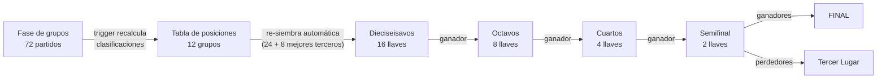
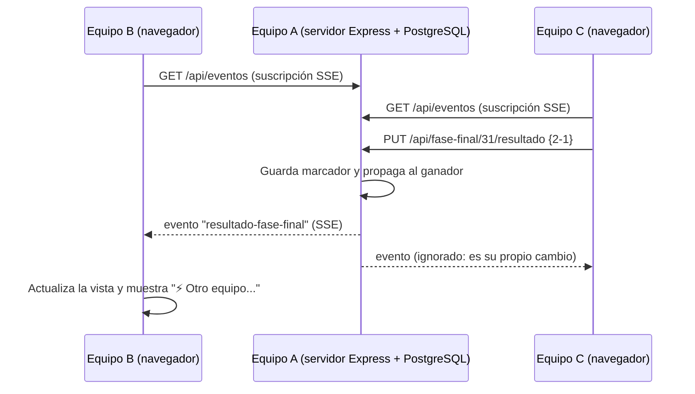

# Copa Mundial FIFA 2026
## Sistema de Simulación, Administración y Geolocalización
### Segunda Entrega — Resultados por fase, sistema completo hasta la Final, estadios ampliados, tiempo real en red y nuevas vistas

---

| Campo | Dato |
|-------|------|
| **Universidad** | _______________________________ |
| **Materia** | _______________________________ |
| **Maestro(a)** | _______________________________ |
| **Equipo** | _______________________________ |
| **Integrantes** | _______________________________ |
| | _______________________________ |
| | _______________________________ |
| **Base de datos asignada** | **PostgreSQL** |
| **Fecha de entrega** | Julio de 2026 |

---

## Índice

1. Atención a las observaciones del profesor
2. Módulo de carga de resultados (todas las fases, con propagación)
3. Demostración real: un cambio en grupos modifica los dieciseisavos
4. Demostración real: en eliminatorias el ganador avanza solo
5. Sistema completo hasta la Final — datos precargados hasta Semifinales
6. Trabajo en red en TIEMPO REAL (un equipo como servidor)
7. Módulo de estadios ampliado
8. Rediseño de las vistas
9. Estado de los módulos del sistema
10. Cómo ejecutar y probar el sistema

---

## 1. Atención a las observaciones del profesor

| # | Observación | Solución implementada |
|---|-------------|------------------------|
| 1 | Desarrollar el módulo donde se actualizan los resultados y ver cómo un cambio en la fase de grupos se refleja **hasta la fase de dieciseisavos**. | Nuevo módulo **Resultados**: al corregir un marcador de grupos, un *trigger* de PostgreSQL recalcula la tabla de posiciones y el backend **re-siembra automáticamente las llaves de dieciseisavos** afectadas (sección 3, con evidencia real). |
| 2 | La parte de estadios está muy simple; dar más información además de los mínimos solicitados. | La tabla `estadios` se amplió con **historia, año de apertura, superficie, techo y equipo local**, además de los mínimos (nombre, ubicación con Google Maps, equipos, fechas, horarios y costo de boletos). Ahora también se listan los **partidos de eliminatorias** de cada estadio (sección 7). |
| 3 | Hay equipos que no han metido los resultados de grupos y no se ve cómo se liga con dieciseisavos. | Los **72 resultados** de la fase de grupos vienen precargados y el cuadro de fase final viene **jugado hasta Semifinales**: la liga grupos → dieciseisavos → … → Final es visible desde el primer arranque y reacciona en vivo a cualquier corrección. |
| 4 | Las vistas están muy simples; ser más creativos. | Rediseño completo de la interfaz: nueva tipografía, fondo con los colores de los tres países sede, tarjetas con animaciones, cuenta regresiva en vivo a la Final, navegación tipo píldora y cuadro de eliminatorias con ganadores resaltados (sección 8). |
| 5 | Entregar el sistema completo hasta la fase final (octavos, cuartos, semifinales, tercer lugar y final), **ya con todos los datos hasta Semifinales**. | El sistema cubre y trae **capturadas** todas las rondas hasta Semifinal; el **Tercer Lugar y la Final quedan con sus equipos definidos, pendientes de capturar** en la revisión (sección 5). |
| 6 | Un equipo funciona como **servidor** y los demás realizan modificaciones **en tiempo real** viendo los cambios. | El servidor escucha en la red local (muestra sus direcciones al arrancar) y difunde cada modificación por **Server-Sent Events**: todos los navegadores conectados actualizan su vista al instante, sin recargar (sección 6). |

---

## 2. Módulo de carga de resultados (todas las fases)

El módulo **Resultados** (pestaña propia en el menú) permite al usuario o
administrador **capturar y corregir marcadores de las 7 fases** del torneo:
Grupos, Dieciseisavos, Octavos, Cuartos, Semifinal, Tercer Lugar y Final.

**Comportamiento por fase:**

- **Grupos** — al guardar, el *trigger* `tg_partido_clasificacion` recalcula la
  tabla de posiciones del grupo y el servicio
  `FaseFinalService.sincronizarDieciseisavos()` recalcula los 32 clasificados
  (2 primeros de cada grupo + 8 mejores terceros) y **re-siembra las llaves
  cuyo cruce cambió** (las que no cambian conservan su resultado).
- **Eliminatorias** — al guardar una llave, el **ganador se propaga
  automáticamente** a la ronda siguiente (D→O→C→S→Final); los perdedores de
  semifinal pasan al partido por el **Tercer Lugar**. Un **empate exige
  definición por penales** (el sistema lo valida). Si se **corrige** una llave
  ya jugada, las rondas posteriores que dependían de ella se limpian y
  recalculan en cascada.
- Cada fase muestra su avance (partidos jugados / totales) y un botón para
  **simular la ronda pendiente** con marcadores aleatorios.
- Toda modificación se **difunde en tiempo real** a los demás equipos
  conectados (sección 6).



**Endpoints del módulo:**

| Método | Ruta | Función |
|--------|------|---------|
| PUT | `/api/partidos/:id/resultado` | Marcador de grupos → recalcula clasificación y re-siembra dieciseisavos |
| PUT | `/api/fase-final/:id/resultado` | Marcador de una llave (con penales si hay empate) → propaga al ganador |
| POST | `/api/fase-final/generar` | Genera/regenera el cuadro completo con sedes automáticas |
| POST | `/api/fase-final/simular` | Simula la primera ronda pendiente |
| GET | `/api/eventos` | Flujo de eventos en tiempo real (SSE) para todos los clientes |

---

## 3. Demostración real: un cambio en grupos modifica los dieciseisavos

> Las tablas siguientes **no son un ejemplo inventado**: fueron generadas
> ejecutando la operación contra el sistema en vivo al momento de crear este
> documento.

### 3.1 Estado inicial del Grupo A

| Pos | Bandera | Selección | PJ | PG | PE | PP | GF | GC | DG | Pts |
| --- | --- | --- | --- | --- | --- | --- | --- | --- | --- | --- |
| 1 | 🇲🇽 | Mexico | 3 | 3 | 0 | 0 | 6 | 0 | 6 | 9 |
| 2 | 🇰🇷 | Corea del Sur | 3 | 2 | 0 | 1 | 5 | 3 | 2 | 6 |
| 3 | 🇿🇦 | Sudafrica | 3 | 0 | 1 | 2 | 2 | 6 | -4 | 1 |
| 3 | 🇨🇿 | Republica Checa | 3 | 0 | 1 | 2 | 2 | 6 | -4 | 1 |


### 3.2 Dieciseisavos generados a partir de esa clasificación (antes del cambio)

| Llave | Local | Visitante | Estadio (sede automática) | Fecha | Horario |
| --- | --- | --- | --- | --- | --- |
| D1 | 🇲🇦 Marruecos | 🇵🇦 Panama | MetLife Stadium | 2026-06-28 | 12:00:00 |
| D2 | 🇦🇷 Argentina | 🏴󠁧󠁢󠁳󠁣󠁴󠁿 Escocia | Estadio Azteca | 2026-06-29 | 16:00:00 |
| D3 | 🇵🇹 Portugal | 🇶🇦 Catar | AT&T Stadium | 2026-06-30 | 19:00:00 |
| D4 | 🇲🇽 Mexico | 🇳🇴 Noruega | SoFi Stadium | 2026-07-01 | 12:00:00 |
| D5 | 🇩🇪 Alemania | 🇯🇵 Japon | Arrowhead Stadium | 2026-06-28 | 16:00:00 |
| D6 | 🇫🇷 Francia | 🇦🇺 Australia | Levi's Stadium | 2026-06-29 | 19:00:00 |
| D7 | 🇧🇪 Belgica | 🇮🇷 Iran | NRG Stadium | 2026-06-30 | 12:00:00 |
| D8 | 🏴󠁧󠁢󠁥󠁮󠁧󠁿 Inglaterra | 🇪🇨 Ecuador | Lincoln Financial Field | 2026-07-01 | 16:00:00 |
| D9 | 🇨🇭 Suiza | 🇸🇳 Senegal | Mercedes-Benz Stadium | 2026-06-28 | 19:00:00 |
| D10 | 🇪🇸 Espana | 🇨🇮 Costa de Marfil | Lumen Field | 2026-06-29 | 12:00:00 |
| D11 | 🇳🇱 Paises Bajos | 🇺🇸 Estados Unidos | Hard Rock Stadium | 2026-06-30 | 16:00:00 |
| D12 | 🇹🇷 Turquia | 🇺🇾 Uruguay | Gillette Stadium | 2026-07-01 | 19:00:00 |
| D13 | 🇭🇷 Croacia | 🇪🇬 Egipto | BC Place | 2026-06-28 | 12:00:00 |
| D14 | 🇨🇦 Canada | 🇸🇪 Suecia | Estadio BBVA | 2026-06-29 | 16:00:00 |
| D15 | 🇧🇷 Brasil | 🇦🇹 Austria | Estadio Akron | 2026-06-30 | 19:00:00 |
| D16 | 🇰🇷 Corea del Sur | 🇨🇴 Colombia | BMO Field | 2026-07-01 | 12:00:00 |


### 3.3 El administrador corrige un resultado

En el módulo **Resultados**, se corrige el partido
**Corea del Sur vs Republica Checa** del Grupo A: el marcador pasa de
**2-1** a **0-9** (ahora gana **Republica Checa**, que era último
de su grupo).

### 3.4 Nueva clasificación del Grupo A (recalculada por el trigger)

| Pos | Bandera | Selección | PJ | PG | PE | PP | GF | GC | DG | Pts |
| --- | --- | --- | --- | --- | --- | --- | --- | --- | --- | --- |
| 1 | 🇲🇽 | Mexico | 3 | 3 | 0 | 0 | 6 | 0 | 6 | 9 |
| 2 | 🇨🇿 | Republica Checa | 3 | 1 | 1 | 1 | 10 | 4 | 6 | 4 |
| 3 | 🇰🇷 | Corea del Sur | 3 | 1 | 0 | 2 | 3 | 11 | -8 | 3 |
| 4 | 🇿🇦 | Sudafrica | 3 | 0 | 1 | 2 | 2 | 6 | -4 | 1 |


### 3.5 Dieciseisavos re-sembrados automáticamente

El backend respondió que se re-sembraron **6 llaves**
(D11, D12, D13, D14, D15, D16), marcadas en **negritas**:

| Llave | Local | Visitante | Estadio (sede automática) | Fecha | Horario |
| --- | --- | --- | --- | --- | --- |
| D1 | 🇲🇦 Marruecos | 🇵🇦 Panama | MetLife Stadium | 2026-06-28 | 12:00:00 |
| D2 | 🇦🇷 Argentina | 🏴󠁧󠁢󠁳󠁣󠁴󠁿 Escocia | Estadio Azteca | 2026-06-29 | 16:00:00 |
| D3 | 🇵🇹 Portugal | 🇶🇦 Catar | AT&T Stadium | 2026-06-30 | 19:00:00 |
| D4 | 🇲🇽 Mexico | 🇳🇴 Noruega | SoFi Stadium | 2026-07-01 | 12:00:00 |
| D5 | 🇩🇪 Alemania | 🇯🇵 Japon | Arrowhead Stadium | 2026-06-28 | 16:00:00 |
| D6 | 🇫🇷 Francia | 🇦🇺 Australia | Levi's Stadium | 2026-06-29 | 19:00:00 |
| D7 | 🇧🇪 Belgica | 🇮🇷 Iran | NRG Stadium | 2026-06-30 | 12:00:00 |
| D8 | 🏴󠁧󠁢󠁥󠁮󠁧󠁿 Inglaterra | 🇪🇨 Ecuador | Lincoln Financial Field | 2026-07-01 | 16:00:00 |
| D9 | 🇨🇭 Suiza | 🇸🇳 Senegal | Mercedes-Benz Stadium | 2026-06-28 | 19:00:00 |
| D10 | 🇪🇸 Espana | 🇨🇮 Costa de Marfil | Lumen Field | 2026-06-29 | 12:00:00 |
| **D11** | **🇳🇱 Paises Bajos** | **🇨🇿 Republica Checa** | Hard Rock Stadium | 2026-06-30 | 16:00:00 |
| **D12** | **🇹🇷 Turquia** | **🇺🇸 Estados Unidos** | Gillette Stadium | 2026-07-01 | 19:00:00 |
| **D13** | **🇭🇷 Croacia** | **🇺🇾 Uruguay** | BC Place | 2026-06-28 | 12:00:00 |
| **D14** | **🇨🇦 Canada** | **🇪🇬 Egipto** | Estadio BBVA | 2026-06-29 | 16:00:00 |
| **D15** | **🇧🇷 Brasil** | **🇸🇪 Suecia** | Estadio Akron | 2026-06-30 | 19:00:00 |
| **D16** | **🇨🇴 Colombia** | **🇦🇹 Austria** | BMO Field | 2026-07-01 | 12:00:00 |


Al restaurar el marcador original, el sistema regresó solo al cuadro inicial.

---

## 4. Demostración real: en eliminatorias el ganador avanza solo

Estado inicial de la llave **O1** de octavos: local = *Por definir*,
visitante = *Por definir* (ambos por definir).

1. Se captura **D1: Marruecos 2 – 1 Panama** → el sistema responde
   `llaves_actualizadas: ["O1"]` y coloca a
   **Marruecos** como local de O1.
2. Se intenta capturar **D2: Argentina 1 – 1 Escocia** *sin penales* →
   el sistema lo **rechaza**: “En eliminatorias un empate se define por penales: captura penales distintos para cada equipo.”.
3. Se captura **D2: 1 – 1 (penales 3 – 4)** → gana **Escocia** y el sistema
   responde `llaves_actualizadas: ["O1"]`.

**Resultado:** la llave O1 de octavos quedó **Marruecos vs Escocia**,
sin intervención manual. La misma cascada continúa hasta la Final: los ganadores
de semifinal se colocan en la Final y los perdedores en el Tercer Lugar.

---

## 5. Sistema completo hasta la Final — datos precargados hasta Semifinales

El sistema se entrega con el torneo **capturado hasta las Semifinales**
(marcadores deterministas basados en el ranking FIFA, cargados a través del
mismo módulo de resultados). El **Tercer Lugar y la Final** tienen a sus
equipos definidos por la propagación automática y quedan **pendientes de
capturar**, listos para demostrarse en la revisión. Este estado viene incluido
en la base de datos (`db/seed-fasefinal.sql` con Docker, o `db/instalar.sql`
con pgAdmin).

### Dieciseisavos de final

| Llave | Local | Marcador | Visitante | Estadio | Fecha |
| --- | --- | --- | --- | --- | --- |
| D1 | 🇲🇦 Marruecos | 2 – 0 | 🇵🇦 Panama | MetLife Stadium | 2026-06-28 |
| D2 | 🇦🇷 Argentina | 2 – 1 | 🏴󠁧󠁢󠁳󠁣󠁴󠁿 Escocia | Estadio Azteca | 2026-06-29 |
| D3 | 🇵🇹 Portugal | 2 – 1 | 🇶🇦 Catar | AT&T Stadium | 2026-06-30 |
| D4 | 🇲🇽 Mexico | 2 – 0 | 🇳🇴 Noruega | SoFi Stadium | 2026-07-01 |
| D5 | 🇩🇪 Alemania | 1 – 2 | 🇯🇵 Japon | Arrowhead Stadium | 2026-06-28 |
| D6 | 🇫🇷 Francia | 1 – 1 (pen 5–3) | 🇦🇺 Australia | Levi's Stadium | 2026-06-29 |
| D7 | 🇧🇪 Belgica | 2 – 2 (pen 5–3) | 🇮🇷 Iran | NRG Stadium | 2026-06-30 |
| D8 | 🏴󠁧󠁢󠁥󠁮󠁧󠁿 Inglaterra | 3 – 2 | 🇪🇨 Ecuador | Lincoln Financial Field | 2026-07-01 |
| D9 | 🇨🇭 Suiza | 2 – 3 | 🇸🇳 Senegal | Mercedes-Benz Stadium | 2026-06-28 |
| D10 | 🇪🇸 Espana | 2 – 1 | 🇨🇮 Costa de Marfil | Lumen Field | 2026-06-29 |
| D11 | 🇳🇱 Paises Bajos | 3 – 2 | 🇺🇸 Estados Unidos | Hard Rock Stadium | 2026-06-30 |
| D12 | 🇹🇷 Turquia | 1 – 2 | 🇺🇾 Uruguay | Gillette Stadium | 2026-07-01 |
| D13 | 🇭🇷 Croacia | 1 – 1 (pen 5–3) | 🇪🇬 Egipto | BC Place | 2026-06-28 |
| D14 | 🇨🇦 Canada | 1 – 2 | 🇸🇪 Suecia | Estadio BBVA | 2026-06-29 |
| D15 | 🇧🇷 Brasil | 2 – 2 (pen 5–3) | 🇦🇹 Austria | Estadio Akron | 2026-06-30 |
| D16 | 🇰🇷 Corea del Sur | 1 – 1 (pen 3–5) | 🇨🇴 Colombia | BMO Field | 2026-07-01 |


### Octavos de final

| Llave | Local | Marcador | Visitante | Estadio | Fecha |
| --- | --- | --- | --- | --- | --- |
| O1 | 🇲🇦 Marruecos | 2 – 1 | 🇦🇷 Argentina | MetLife Stadium | 2026-07-03 |
| O2 | 🇵🇹 Portugal | 2 – 1 | 🇲🇽 Mexico | Estadio Azteca | 2026-07-04 |
| O3 | 🇯🇵 Japon | 2 – 2 (pen 3–5) | 🇫🇷 Francia | AT&T Stadium | 2026-07-05 |
| O4 | 🇧🇪 Belgica | 1 – 2 | 🏴󠁧󠁢󠁥󠁮󠁧󠁿 Inglaterra | SoFi Stadium | 2026-07-06 |
| O5 | 🇸🇳 Senegal | 1 – 1 (pen 3–5) | 🇪🇸 Espana | Arrowhead Stadium | 2026-07-03 |
| O6 | 🇳🇱 Paises Bajos | 1 – 1 (pen 5–3) | 🇺🇾 Uruguay | Levi's Stadium | 2026-07-04 |
| O7 | 🇭🇷 Croacia | 2 – 2 (pen 5–3) | 🇸🇪 Suecia | NRG Stadium | 2026-07-05 |
| O8 | 🇧🇷 Brasil | 1 – 2 | 🇨🇴 Colombia | Lincoln Financial Field | 2026-07-06 |


### Cuartos de final

| Llave | Local | Marcador | Visitante | Estadio | Fecha |
| --- | --- | --- | --- | --- | --- |
| C1 | 🇲🇦 Marruecos | 1 – 2 | 🇵🇹 Portugal | Mercedes-Benz Stadium | 2026-07-09 |
| C2 | 🇫🇷 Francia | 1 – 2 | 🏴󠁧󠁢󠁥󠁮󠁧󠁿 Inglaterra | Lumen Field | 2026-07-10 |
| C3 | 🇪🇸 Espana | 1 – 2 | 🇳🇱 Paises Bajos | Hard Rock Stadium | 2026-07-11 |
| C4 | 🇭🇷 Croacia | 2 – 2 (pen 5–3) | 🇨🇴 Colombia | Gillette Stadium | 2026-07-09 |


### Semifinales

| Llave | Local | Marcador | Visitante | Estadio | Fecha |
| --- | --- | --- | --- | --- | --- |
| S1 | 🇵🇹 Portugal | 2 – 1 | 🏴󠁧󠁢󠁥󠁮󠁧󠁿 Inglaterra | BC Place | 2026-07-14 |
| S2 | 🇳🇱 Paises Bajos | 2 – 1 | 🇭🇷 Croacia | Estadio BBVA | 2026-07-15 |


### Tercer Lugar y Final (pendientes de capturar)

| Llave | Local | Marcador | Visitante | Estadio | Fecha |
| --- | --- | --- | --- | --- | --- |
| T1 | 🏴󠁧󠁢󠁥󠁮󠁧󠁿 Inglaterra | **por jugar** | 🇭🇷 Croacia | Estadio Azteca | 2026-07-18 |
| F1 | 🇵🇹 Portugal | **por jugar** | 🇳🇱 Paises Bajos | MetLife Stadium | 2026-07-19 |


---

## 6. Trabajo en red en TIEMPO REAL (un equipo como servidor)

El requisito de que *“un equipo funcione como el servidor y los demás equipos
puedan realizar modificaciones en tiempo real y se vean los cambios”* está
resuelto con **Server-Sent Events (SSE)**:

- El equipo servidor ejecuta `npm start`; la consola imprime sus direcciones
  de red local (por ejemplo `http://192.168.1.50:3000`).
- Los demás equipos **solo abren esa dirección en su navegador**; no instalan
  nada. El indicador **“En vivo”** de la barra superior confirma la conexión.
- Cada navegador se suscribe a `GET /api/eventos`. Cuando cualquier cliente
  guarda un resultado, da un alta o regenera el cuadro, el servidor **difunde
  el evento a todos los conectados**: la vista activa de cada uno se actualiza
  sola y muestra una notificación (por ejemplo, *“⚡ Otro equipo capturó una
  llave de la fase final”*).
- Cada navegador envía un identificador propio (cabecera `X-Cliente`) para
  ignorar sus propios eventos; si el usuario está escribiendo en un campo, la
  recarga se pospone hasta que lo suelta, para no borrarle lo capturado.



---

## 7. Módulo de estadios ampliado

Cada estadio cumple los **mínimos solicitados** (nombre en cuadro emergente,
ubicación con Google Maps por latitud/longitud, equipos que jugarán, fechas,
horarios y costo de boletos) y ahora se amplió con **historia, año de apertura,
tipo de superficie, tipo de techo, equipo local, fases que alberga, costo de
boletos por fase y compartir en redes sociales**. Los partidos listados incluyen
también los de **eliminatorias** (por ejemplo, el Estadio Azteca tiene
**8 partidos**, incluyendo fase final).

**Ejemplo de la información histórica capturada (Estadio Azteca):**

> El Coloso de Santa Ursula es el unico estadio que ha albergado dos finales de Copa del Mundo (1970 y 1986). En 2026 hace historia al inaugurar su tercer Mundial. Aqui Maradona anoto la "Mano de Dios" y el "Gol del Siglo".

### Los 16 estadios sede con su información ampliada

| Estadio | Ciudad | País | Capacidad | Apertura | Superficie | Techo | Equipo local |
| --- | --- | --- | --- | --- | --- | --- | --- |
| BC Place | Vancouver | Canada | 52497 | 1983 | Cesped natural reforzado (instalado para 2026) | Retractil | Vancouver Whitecaps FC |
| BMO Field | Toronto | Canada | 43036 | 2007 | Cesped hibrido | Abierto (gradas techadas) | Toronto FC |
| AT&T Stadium | Arlington | Estados Unidos | 70649 | 2009 | Cesped hibrido (instalado para 2026) | Retractil | Dallas Cowboys |
| Arrowhead Stadium | Kansas City | Estados Unidos | 69045 | 1972 | Cesped natural | Abierto | Kansas City Chiefs |
| Gillette Stadium | Foxborough | Estados Unidos | 64146 | 2002 | Cesped artificial (natural para 2026) | Abierto | New England Patriots / Revolution |
| Hard Rock Stadium | Miami Gardens | Estados Unidos | 64478 | 1987 | Cesped natural | Parcial (cubre las gradas) | Miami Dolphins |
| Levi's Stadium | Santa Clara | Estados Unidos | 68827 | 2014 | Cesped natural | Abierto | San Francisco 49ers |
| Lincoln Financial Field | Philadelphia | Estados Unidos | 68324 | 2003 | Cesped hibrido | Abierto | Philadelphia Eagles |
| Lumen Field | Seattle | Estados Unidos | 66925 | 2002 | Cesped artificial (natural para 2026) | Parcial (cubre 70% de gradas) | Seattle Sounders FC / Seahawks |
| Mercedes-Benz Stadium | Atlanta | Estados Unidos | 68239 | 2017 | Cesped artificial FieldTurf (natural para 2026) | Retractil de 8 paneles | Atlanta United FC / Atlanta Falcons |
| MetLife Stadium | East Rutherford | Estados Unidos | 82500 | 2010 | Cesped natural (instalado para 2026) | Abierto | New York Giants / New York Jets |
| NRG Stadium | Houston | Estados Unidos | 68777 | 2002 | Cesped natural (instalado para 2026) | Retractil | Houston Texans |
| SoFi Stadium | Inglewood | Estados Unidos | 70492 | 2020 | Cesped natural (instalado para 2026) | Fijo translucido | Los Angeles Rams / Chargers |
| Estadio Akron | Zapopan | Mexico | 45664 | 2010 | Cesped hibrido | Abierto | Chivas de Guadalajara |
| Estadio Azteca | Ciudad de Mexico | Mexico | 80824 | 1966 | Cesped hibrido | Abierto | Club America / Seleccion de Mexico |
| Estadio BBVA | Guadalupe | Mexico | 51243 | 2015 | Cesped hibrido | Abierto | CF Monterrey |


---

## 8. Rediseño de las vistas

La interfaz se rediseñó por completo para atender la observación 4:

- **Tipografías** Outfit (títulos y cifras) e Inter (texto), vía Google Fonts.
- **Identidad visual de los 3 países sede**: fondo nocturno con gradientes en
  verde (México), azul (EE. UU.) y rojo (Canadá); franja tricolor en la barra
  superior y balón giratorio en el logotipo.
- **Portada** con gradientes animados, contadores animados y **cuenta regresiva
  en vivo a la Gran Final** (días, horas, minutos y segundos).
- **Navegación tipo píldora** con pestaña activa dorada e indicador **“En
  vivo”** del estado de la conexión en tiempo real.
- **Tarjetas con animaciones** (elevación al pasar el cursor) en selecciones,
  estadios y cifras del torneo.
- **Tablas** con encabezados destacados, filas cebra y los clasificados
  marcados con barra verde.
- **Estadios**: encabezado con gradiente del país sede y bandera en marca de
  agua, insignias de capacidad/año/partidos y reseña histórica resaltada.
- **Cuadro de eliminatorias** con llaves jugadas resaltadas, ganador en verde y
  marcadores con penales.
- **Módulo de resultados** con chips de fase (avance jugados/totales) y
  captura en línea con validación de penales.

---

## 9. Estado de los módulos del sistema

| # | Módulo | Estado |
|---|--------|--------|
| 1 | Inicio | ✔ Terminado |
| 2 | Confederaciones | ✔ Terminado |
| 3 | Selecciones | ✔ Terminado |
| 4 | Grupos | ✔ Terminado |
| 5 | Calendario | ✔ Terminado (incluye eliminatorias) |
| 6 | Clasificación | ✔ Terminado |
| 7 | Simulador | ✔ Terminado |
| 8 | **Resultados (nuevo)** | ✔ Terminado |
| 9 | Fase Final | ✔ Terminado (completo hasta la Final, con datos hasta Semifinales) |
| 10 | Estadios | ✔ Terminado (información ampliada) |
| 11 | Geolocalización | ✔ Terminado |
| 12 | Boletos | ✔ Terminado |
| 13 | Administrador | ✔ Terminado |
| 14 | Acerca del Proyecto | ✔ Terminado |

Adicionalmente, el **tiempo real multi-equipo** (sección 6) funciona de forma
transversal en todos los módulos que modifican datos.

---

## 10. Cómo ejecutar y probar el sistema

**Equipo servidor:**

```bash
docker compose up -d      # 1) BD (carga schema + seed + fase final hasta semifinales)
npm install               # 2) Dependencias
npm start                 # 3) Servidor -> muestra las direcciones de red local
```

**Demás equipos:** abrir en el navegador la dirección que muestra el servidor
(por ejemplo `http://192.168.1.50:3000`).

**Guion de demostración sugerido:**

1. Pestaña **Fase Final**: el torneo está jugado hasta Semifinales; el Tercer
   Lugar y la Final esperan resultado.
2. Pestaña **Resultados** → fase **Final**: capturar el marcador de la Final
   (si hay empate, el sistema pide penales). Todos los equipos conectados ven
   el campeón **al instante**.
3. Fase **Grupos**: corregir cualquier marcador; la notificación indica
   cuántas llaves de dieciseisavos se re-sembraron y las rondas posteriores
   afectadas se limpian en cascada (verificable en **Fase Final**).
4. Botón **“Simular ronda pendiente”** para volver a completar el torneo
   ronda por ronda.
5. Para regresar exactamente al estado de entrega:
   `npm run entrega:estado` (o `npm run db:reset` + reiniciar el servidor).

> Instalación alternativa sin Docker: ejecutar `db/instalar.sql` (esquema +
> datos + cuadro hasta semifinales) en una base nueva desde pgAdmin.
